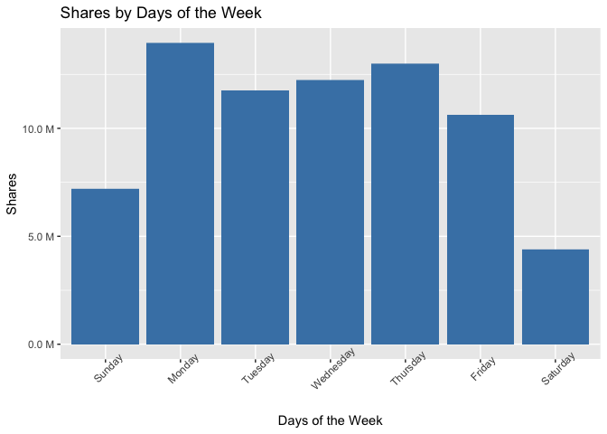
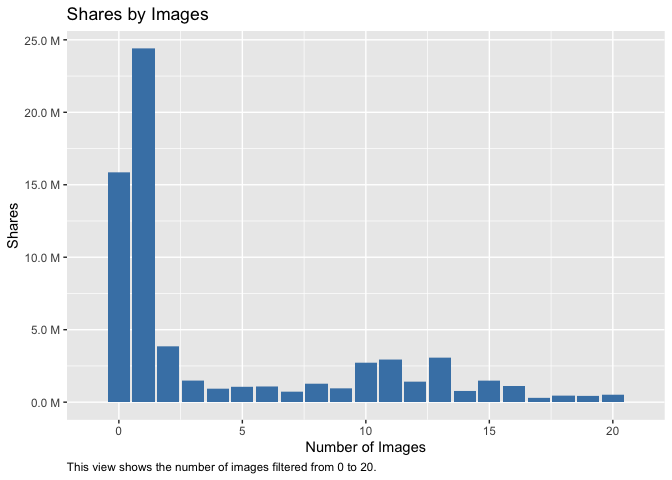
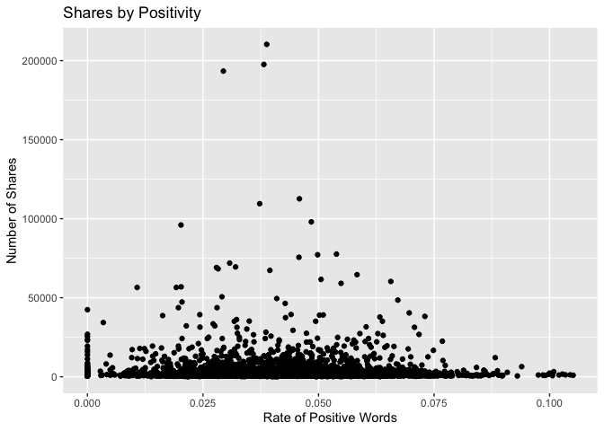
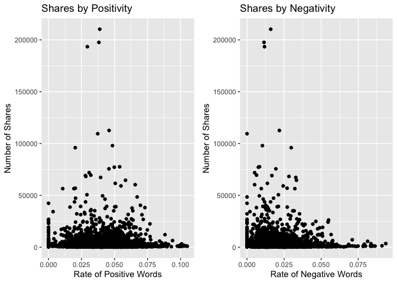

Project Two
================
Mary Brown and Jennifer Relihan
10/21/2021

=======

## Introduction

This report uses the Online News Popularity Data Set from the UCI
Machine Learning Repository. The data set summarizes information about
articles published by Mashable over the course of two years.There are
39,644 rows of data and 61 columns. The columns are made up of mostly
numeric attributes but also contain an integer and character column.

Our target variable in this data set is shares. This column represents
the number of shares in social networks thus showing its popularity.

We’ve used multiple columns in this data set in our exploratory data
analysis and created a few of our own to assist in exploration. We
created a column called Popularity which will rate by either “Popular”
or “Unpopular.” To do this, we found the median value for the amount of
shares. We also looked at the weekdays vs weekend, the average shares of
referenced articles in Mashable (self\_reference\_avg\_shares) ,the
number of videos (num\_videos) and number of images (num\_imgs), the
number of words in a piece of content (n\_tokens\_content), and the rate
of positive or negative words in the content
(global\_rate\_positive\_words, global\_rate\_negative\_words).

The purpose of this analysis is to attempt to build a model that can
predict shares by using variables in the dataset to help inform the
model. In this report we test two versions of linear regression models,
a random forest model, and a boosted tree model.In order to do this we
split our data set into a training (70% of the data) and a test set (30%
of the data).

## Required to run this document

``` r
library(tidyverse)  
library(caret)  
library(ggplot2)  
library(ggpubr)  
library(magrittr)  
library(scales)
library(GDAtools)
library(gbm)
library(shiny)
```

## Data Manipulation

``` r
# Here we read in the data and learn more about the dimensions as well as different column names.
Data<-read.csv("OnlineNewsPopularity.csv") 
dim(Data)  
```

    ## [1] 39644    61

``` r
names(Data)  
```

    ##  [1] "url"                           "timedelta"                     "n_tokens_title"               
    ##  [4] "n_tokens_content"              "n_unique_tokens"               "n_non_stop_words"             
    ##  [7] "n_non_stop_unique_tokens"      "num_hrefs"                     "num_self_hrefs"               
    ## [10] "num_imgs"                      "num_videos"                    "average_token_length"         
    ## [13] "num_keywords"                  "data_channel_is_lifestyle"     "data_channel_is_entertainment"
    ## [16] "data_channel_is_bus"           "data_channel_is_socmed"        "data_channel_is_tech"         
    ## [19] "data_channel_is_world"         "kw_min_min"                    "kw_max_min"                   
    ## [22] "kw_avg_min"                    "kw_min_max"                    "kw_max_max"                   
    ## [25] "kw_avg_max"                    "kw_min_avg"                    "kw_max_avg"                   
    ## [28] "kw_avg_avg"                    "self_reference_min_shares"     "self_reference_max_shares"    
    ## [31] "self_reference_avg_sharess"    "weekday_is_monday"             "weekday_is_tuesday"           
    ## [34] "weekday_is_wednesday"          "weekday_is_thursday"           "weekday_is_friday"            
    ## [37] "weekday_is_saturday"           "weekday_is_sunday"             "is_weekend"                   
    ## [40] "LDA_00"                        "LDA_01"                        "LDA_02"                       
    ## [43] "LDA_03"                        "LDA_04"                        "global_subjectivity"          
    ## [46] "global_sentiment_polarity"     "global_rate_positive_words"    "global_rate_negative_words"   
    ## [49] "rate_positive_words"           "rate_negative_words"           "avg_positive_polarity"        
    ## [52] "min_positive_polarity"         "max_positive_polarity"         "avg_negative_polarity"        
    ## [55] "min_negative_polarity"         "max_negative_polarity"         "title_subjectivity"           
    ## [58] "title_sentiment_polarity"      "abs_title_subjectivity"        "abs_title_sentiment_polarity" 
    ## [61] "shares"

``` r
str(Data)  
```

    ## 'data.frame':    39644 obs. of  61 variables:
    ##  $ url                          : chr  "http://mashable.com/2013/01/07/amazon-instant-video-browser/" "http://mashable.com/2013/01/07/ap-samsung-sponsored-tweets/" "http://mashable.com/2013/01/07/apple-40-billion-app-downloads/" "http://mashable.com/2013/01/07/astronaut-notre-dame-bcs/" ...
    ##  $ timedelta                    : num  731 731 731 731 731 731 731 731 731 731 ...
    ##  $ n_tokens_title               : num  12 9 9 9 13 10 8 12 11 10 ...
    ##  $ n_tokens_content             : num  219 255 211 531 1072 ...
    ##  $ n_unique_tokens              : num  0.664 0.605 0.575 0.504 0.416 ...
    ##  $ n_non_stop_words             : num  1 1 1 1 1 ...
    ##  $ n_non_stop_unique_tokens     : num  0.815 0.792 0.664 0.666 0.541 ...
    ##  $ num_hrefs                    : num  4 3 3 9 19 2 21 20 2 4 ...
    ##  $ num_self_hrefs               : num  2 1 1 0 19 2 20 20 0 1 ...
    ##  $ num_imgs                     : num  1 1 1 1 20 0 20 20 0 1 ...
    ##  $ num_videos                   : num  0 0 0 0 0 0 0 0 0 1 ...
    ##  $ average_token_length         : num  4.68 4.91 4.39 4.4 4.68 ...
    ##  $ num_keywords                 : num  5 4 6 7 7 9 10 9 7 5 ...
    ##  $ data_channel_is_lifestyle    : num  0 0 0 0 0 0 1 0 0 0 ...
    ##  $ data_channel_is_entertainment: num  1 0 0 1 0 0 0 0 0 0 ...
    ##  $ data_channel_is_bus          : num  0 1 1 0 0 0 0 0 0 0 ...
    ##  $ data_channel_is_socmed       : num  0 0 0 0 0 0 0 0 0 0 ...
    ##  $ data_channel_is_tech         : num  0 0 0 0 1 1 0 1 1 0 ...
    ##  $ data_channel_is_world        : num  0 0 0 0 0 0 0 0 0 1 ...
    ##  $ kw_min_min                   : num  0 0 0 0 0 0 0 0 0 0 ...
    ##  $ kw_max_min                   : num  0 0 0 0 0 0 0 0 0 0 ...
    ##  $ kw_avg_min                   : num  0 0 0 0 0 0 0 0 0 0 ...
    ##  $ kw_min_max                   : num  0 0 0 0 0 0 0 0 0 0 ...
    ##  $ kw_max_max                   : num  0 0 0 0 0 0 0 0 0 0 ...
    ##  $ kw_avg_max                   : num  0 0 0 0 0 0 0 0 0 0 ...
    ##  $ kw_min_avg                   : num  0 0 0 0 0 0 0 0 0 0 ...
    ##  $ kw_max_avg                   : num  0 0 0 0 0 0 0 0 0 0 ...
    ##  $ kw_avg_avg                   : num  0 0 0 0 0 0 0 0 0 0 ...
    ##  $ self_reference_min_shares    : num  496 0 918 0 545 8500 545 545 0 0 ...
    ##  $ self_reference_max_shares    : num  496 0 918 0 16000 8500 16000 16000 0 0 ...
    ##  $ self_reference_avg_sharess   : num  496 0 918 0 3151 ...
    ##  $ weekday_is_monday            : num  1 1 1 1 1 1 1 1 1 1 ...
    ##  $ weekday_is_tuesday           : num  0 0 0 0 0 0 0 0 0 0 ...
    ##  $ weekday_is_wednesday         : num  0 0 0 0 0 0 0 0 0 0 ...
    ##  $ weekday_is_thursday          : num  0 0 0 0 0 0 0 0 0 0 ...
    ##  $ weekday_is_friday            : num  0 0 0 0 0 0 0 0 0 0 ...
    ##  $ weekday_is_saturday          : num  0 0 0 0 0 0 0 0 0 0 ...
    ##  $ weekday_is_sunday            : num  0 0 0 0 0 0 0 0 0 0 ...
    ##  $ is_weekend                   : num  0 0 0 0 0 0 0 0 0 0 ...
    ##  $ LDA_00                       : num  0.5003 0.7998 0.2178 0.0286 0.0286 ...
    ##  $ LDA_01                       : num  0.3783 0.05 0.0333 0.4193 0.0288 ...
    ##  $ LDA_02                       : num  0.04 0.0501 0.0334 0.4947 0.0286 ...
    ##  $ LDA_03                       : num  0.0413 0.0501 0.0333 0.0289 0.0286 ...
    ##  $ LDA_04                       : num  0.0401 0.05 0.6822 0.0286 0.8854 ...
    ##  $ global_subjectivity          : num  0.522 0.341 0.702 0.43 0.514 ...
    ##  $ global_sentiment_polarity    : num  0.0926 0.1489 0.3233 0.1007 0.281 ...
    ##  $ global_rate_positive_words   : num  0.0457 0.0431 0.0569 0.0414 0.0746 ...
    ##  $ global_rate_negative_words   : num  0.0137 0.01569 0.00948 0.02072 0.01213 ...
    ##  $ rate_positive_words          : num  0.769 0.733 0.857 0.667 0.86 ...
    ##  $ rate_negative_words          : num  0.231 0.267 0.143 0.333 0.14 ...
    ##  $ avg_positive_polarity        : num  0.379 0.287 0.496 0.386 0.411 ...
    ##  $ min_positive_polarity        : num  0.1 0.0333 0.1 0.1364 0.0333 ...
    ##  $ max_positive_polarity        : num  0.7 0.7 1 0.8 1 0.6 1 1 0.8 0.5 ...
    ##  $ avg_negative_polarity        : num  -0.35 -0.119 -0.467 -0.37 -0.22 ...
    ##  $ min_negative_polarity        : num  -0.6 -0.125 -0.8 -0.6 -0.5 -0.4 -0.5 -0.5 -0.125 -0.5 ...
    ##  $ max_negative_polarity        : num  -0.2 -0.1 -0.133 -0.167 -0.05 ...
    ##  $ title_subjectivity           : num  0.5 0 0 0 0.455 ...
    ##  $ title_sentiment_polarity     : num  -0.188 0 0 0 0.136 ...
    ##  $ abs_title_subjectivity       : num  0 0.5 0.5 0.5 0.0455 ...
    ##  $ abs_title_sentiment_polarity : num  0.188 0 0 0 0.136 ...
    ##  $ shares                       : int  593 711 1500 1200 505 855 556 891 3600 710 ...

``` r
# Making a column in the Data table with the name of the data channel.
Data<- Data %>% mutate(channel = ifelse(data_channel_is_lifestyle ==1, 'Lifestyle',
                               ifelse(data_channel_is_entertainment ==1, 'Entertainment',
                                    ifelse(data_channel_is_bus==1, "Business", 
                                    ifelse(data_channel_is_socmed ==1, "Social Media",
                                    ifelse(data_channel_is_tech ==1, "Tech",
                                    ifelse(data_channel_is_world ==1, "World", "Null"  
                                           )))))))

# Check for any missing values  
sum(is.na(Data))
```

    ## [1] 0

``` r
# In order to work with days of the week, we created a column that shows all of the days of the week by shares.  
Days = c('Sunday', 'Monday', 'Tuesday', 'Wednesday', 'Thursday', 'Friday', 'Saturday')  
Data<- Data %>% mutate(weekday = ifelse(weekday_is_monday==1, 'Monday',  
                                    ifelse(weekday_is_tuesday==1, 'Tuesday',   
                                    ifelse(weekday_is_wednesday==1, "Wednesday", 
                                    ifelse(weekday_is_thursday==1, "Thursday",
                                    ifelse(weekday_is_friday==1, "Friday",
                                    ifelse(weekday_is_saturday==1, "Saturday", "Sunday"  
                                           ))))))) %>% mutate(weekday = factor(weekday, levels = Days))  


# After reviewing the attributes information on the website, we need to remove the non-predictive variables which are URL and Time Delta.
Data <- Data %>% select(-url, -timedelta)  

##################################################

#Adding in Automation:
params$channel
```

    ## [1] "Entertainment"

``` r
# Subset the data by channels and remove columns starting with "data_channel_is"  
channelData <- Data %>% filter(channel == params$channel) %>% select(-starts_with("data_channel_is_"))

##################################################


# We would like to create a popularity column by shares for future analysis. This popularity column will rate by either "Popular" or "Unpopular." To do this, we found the median value for the amount of shares. 
ShareSummary <- channelData %>% summarize(median = median(shares))  
channelData <- channelData %>% mutate(Popularity = ifelse(shares>1200, "Popular","Unpopular"))  


# Before doing any exploratory data analysis (EDA), we need to split the data -70% train and 30% test.
NumericData <- dplyr::select_if(channelData, is.numeric)
set.seed(123)
DataIndex<-createDataPartition(y = channelData$shares, p = 0.7, list = FALSE)  
TrainData <- channelData[DataIndex,]
TestData <- channelData[-DataIndex,]  
dim(TrainData)  
```

    ## [1] 4941   56

``` r
dim(TestData)
```

    ## [1] 2116   56

## Exploratory Data Analysis

``` r
# This table shows summary statistics for our 'shares' data point. 
SharesStats <- TrainData %>% summarize(Avg = mean(shares), Median = median(shares), STDV = sd(shares), IQR = IQR(shares))
knitr::kable(SharesStats, caption = "Summary Statistics on Shares", digits = 0)
```

|  Avg | Median | STDV |  IQR |
|-----:|-------:|-----:|-----:|
| 2958 |   1200 | 8041 | 1267 |

Summary Statistics on Shares

``` r
# This table shows the summary statistics for shares by weekday. 
Weekdays <- TrainData %>% group_by(weekday) %>% summarise(Avg = round(mean(shares)), Maximum = round(max(shares)), Minimum = round(min(shares))) 
knitr::kable(Weekdays, caption = "Summary Statistics on Shares by Weekdays", digits = 2)  
```

| weekday   |  Avg | Maximum | Minimum |
|:----------|-----:|--------:|--------:|
| Sunday    | 3998 |   69500 |     171 |
| Monday    | 3017 |  112600 |      59 |
| Tuesday   | 2567 |   98000 |      47 |
| Wednesday | 2646 |  109500 |      84 |
| Thursday  | 2989 |  197600 |      57 |
| Friday    | 3133 |  210300 |      58 |
| Saturday  | 3227 |   68300 |      65 |

Summary Statistics on Shares by Weekdays

``` r
# Showing popularity for the days of the week. A designation of Popular is when the number of shares is greater than 1200, and less than 1200 is considered Unpopular.
weekday_popularity <- table(TrainData$weekday, TrainData$Popularity)
weekday_popularity
```

    ##            
    ##             Popular Unpopular
    ##   Sunday        253       107
    ##   Monday        388       537
    ##   Tuesday       377       538
    ##   Wednesday     362       562
    ##   Thursday      369       500
    ##   Friday        308       369
    ##   Saturday      186        85

``` r
# Showing popularity for weekdays vs weekends.For the y-axis column 0 = weekday and 1 = weekend. Here we can summarize popularity of content based on if it was shared over the weekend or during the week. 
is_weekend_pop <- table(TrainData$is_weekend, TrainData$Popularity)
is_weekend_pop
```

    ##    
    ##     Popular Unpopular
    ##   0    1804      2506
    ##   1     439       192

``` r
# This is a table displaying the average number of shares of referenced articles in mashable, by weekday. 
GDAtools::wtable(TrainData$weekday, w = TrainData$self_reference_avg_sharess)
```

    ##    Sunday    Monday   Tuesday Wednesday  Thursday    Friday  Saturday       Sum 
    ##   2083460   4435183   4558103   4650613   4058313   3396717   1529891  24712280

``` r
# This is a table displaying average keywords on certain days of the week  
Keywords <- TrainData %>% group_by(weekday) %>% summarise(Average = mean(self_reference_avg_sharess), Median = median(self_reference_avg_sharess), STDV = sd(self_reference_avg_sharess), IQR = IQR(self_reference_avg_sharess))  
knitr::kable(Keywords, caption = "Summary statistics of average shares of referenced articles by specific days of the week", digits = 2)
```

| weekday   | Average |  Median |     STDV |     IQR |
|:----------|--------:|--------:|---------:|--------:|
| Sunday    | 5787.39 | 2346.90 | 12943.85 | 3825.00 |
| Monday    | 4794.79 | 1933.33 | 14369.15 | 3355.50 |
| Tuesday   | 4981.53 | 2100.00 |  8711.15 | 4193.80 |
| Wednesday | 5033.13 | 2029.07 | 10070.74 | 4019.50 |
| Thursday  | 4670.10 | 2066.67 |  8952.19 | 3862.83 |
| Friday    | 5017.31 | 2000.00 | 10974.97 | 3950.50 |
| Saturday  | 5645.35 | 2118.33 | 19230.65 | 3757.42 |

Summary statistics of average shares of referenced articles by specific
days of the week

### Plots

``` r
# Plot 1: 
# This plot displays the number of shares by weekday. 
DaysPlot <- TrainData %>% ggplot(aes(x = weekday, y = shares)) + geom_bar(stat = "identity", fill = "steelblue") + scale_y_continuous(labels = unit_format(unit = "M", scale = 5e-6)) + ggtitle("Shares by Days of the Week") + labs(y = "Shares", x = "Days of the Week") + theme(axis.text.x = element_text(angle = 45))
print(DaysPlot)  
```

<!-- -->

``` r
# Plot 2:
# This plot displays the popularity of shares by days of the week.
PopularityPlot <- TrainData %>% ggplot(aes(x = weekday)) + geom_bar(aes(fill = as.factor(Popularity))) + labs(x = "Popularity by Day") + theme(axis.text.x = element_text(angle = 45)) + scale_fill_discrete(name = "Popularity")  
print(PopularityPlot)
```

<!-- -->

``` r
# Plot 3:
# This plot displays shares by the number of Videos.
Videos <- TrainData %>% ggplot(aes(x = num_videos, y = shares)) + geom_bar(stat = "identity", fill = "tan3") + xlim(-1,21) + scale_y_continuous(labels = unit_format(unit = "M", scale = 5e-6)) + ggtitle("Shares by Videos") + labs(y = "Shares", x = "Number of Videos", caption = "This view shows the number of videos filtered from 0 to 20.") + theme(plot.caption = element_text(hjust = 0))  
print(Videos)  
```

<!-- -->

``` r
# Plot 4:
# This plot displays shares by the number of images. 
Images <- TrainData %>% ggplot(aes(x = num_imgs, y = shares)) + geom_bar(stat = "identity", fill = "steelblue") + xlim(-1,21) + scale_y_continuous(labels = unit_format(unit = "M", scale = 5e-6)) + ggtitle("Shares by Images") + labs(y = "Shares", x = "Number of Images", caption = "This view shows the number of images filtered from 0 to 20.") + theme(plot.caption = element_text(hjust =0))
print(Images) 
```

<!-- -->

``` r
# Plot 5:
# This changes word content 0 values to NA. We do this because we want to see the articles with words and how many shares they get. The 0 values had a lot more shares but are comprised of videos or photos with no words.
TrainData$n_tokens_content[TrainData$n_tokens_content == 0] <- NA
# The number of shares based on the number of words in the content to review how this effects shares.
Num_words <- ggplot(TrainData, aes(x=n_tokens_content, y=shares))+ geom_bar(stat = "identity", fill="steelblue") + labs(y="Number of Shares", x="Number of Words") + ggtitle("Shares by Content Size") + theme(plot.caption = element_text(hjust =0))
# Here you can review the trend of shares as a function of the size or word count of an article.
Num_words
```

<!-- -->

``` r
# Plot 6:
# Here we are exploring how the rate of positive words in an article effect the amount of shares
positivity <- ggplot(TrainData, aes(x=global_rate_positive_words, y=shares))+ geom_point(stat = "identity", fill="steelblue") + labs(y="Number of Shares", x="Rate of Positive Words") + ggtitle("Shares by Positivity") + theme(plot.caption = element_text(hjust =0))
positivity
```

<!-- -->

``` r
# Plot 7:
# Here we are exploring how the rate of negative words in an article effect the amount of shares
negativity <- ggplot(TrainData, aes(x=global_rate_negative_words, y=shares))+ geom_point(stat = "identity", fill="steelblue") + labs(y="Number of Shares", x="Rate of Negative Words") + ggtitle("Shares by Negativity") + theme(plot.caption = element_text(hjust =0))
negativity
```

<!-- -->

``` r
# Putting Plots 4 and 5 together to review side by side.Here you can review the shares by the rate of positive or negative content. Another point of review is to look at the rate of positive or negative words based off of the channel type. For instance, entertainment articles have a max rate of 0.10 positive content and a max rate of 0.093 for negative words in this training data set. We can see that the site Mashable tends to write more positive content for entertainment.
pos_neg_join <- ggpubr::ggarrange(positivity, negativity,ncol=2)
pos_neg_join
```

<!-- -->

## Linear Regression Models

### Supervised learning includes regression models, tree based methods, and k nearest neighbors. The basic linear regression model includes a response, a value of our explanatory variable for the ith observation, the y-intercept, and the slope. The model aims to show a linear approach for modeling the relationship between predictors and some response. The model is fit by minimizing the sum of squared residuals, which is equivalent to assuming normality on errors and using maximum liklihood to estimate the beta’s. In R, the basic linear model fits done with lm(). When utilizing lm() in R, statistical analysis can be found using anova() or summary().

``` r
# A summary on the full model shows predictors with significant p-values. I selected predictors with significant p-values to further explore for my linear regression model. This is the model I chose with some significant predictors  
TrainData <- TrainData %>% select(-channel)  
TestData <- TestData %>% select(-channel)

Model1<-as.formula("shares ~ n_unique_tokens + kw_max_min + kw_avg_min + n_non_stop_unique_tokens + num_self_hrefs + num_keywords + kw_min_max + kw_max_avg + global_subjectivity + abs_title_sentiment_polarity + n_tokens_title + global_sentiment_polarity")  

# Fitting the model with the training data 
fit1 <- train(Model1, data = TrainData, 
              method = "lm",  
              preProcess = c("center", "scale"),  
              trControl = trainControl(method = "cv", number = 10))  

# Making a table of the results from the first linear model 
Results <- data.frame(t(fit1$results))  
colnames(Results) <- "Model Results"
knitr::kable(Results, digits = 3)  
```

|            | Model Results |
|:-----------|--------------:|
| intercept  |         1.000 |
| RMSE       |      7982.892 |
| Rsquared   |         0.033 |
| MAE        |      2935.816 |
| RMSESD     |      2045.516 |
| RsquaredSD |         0.058 |
| MAESD      |       201.116 |

``` r
# View Results
Results
```

    ##            Model Results
    ## intercept   1.000000e+00
    ## RMSE        7.982892e+03
    ## Rsquared    3.335327e-02
    ## MAE         2.935816e+03
    ## RMSESD      2.045516e+03
    ## RsquaredSD  5.790696e-02
    ## MAESD       2.011159e+02

``` r
# Linear Regression Model 2:

# After talking with a subject matter expert on marketing we discussed the columns available in the data set and which ones they may be most interested in seeing in a model to predict shares. 

# Fitting the model with the training data.  
fit2 <- train(shares ~weekday + global_rate_positive_words + global_rate_negative_words + title_sentiment_polarity,  
              data = TrainData,  
              method = "lm",   
              preProcess = c("center", "scale"),  
              trControl = trainControl(method = "cv", number = 10))  

# Putting together the results of Model 2
results <- data.frame(t(fit2$results))  
colnames(results) <- "Model Results"  
knitr::kable(results, digits = 3)  
```

|            | Model Results |
|:-----------|--------------:|
| intercept  |         1.000 |
| RMSE       |      7368.580 |
| Rsquared   |         0.002 |
| MAE        |      2920.813 |
| RMSESD     |      3402.365 |
| RsquaredSD |         0.003 |
| MAESD      |       436.673 |

``` r
# View results  
results  
```

    ##            Model Results
    ## intercept   1.000000e+00
    ## RMSE        7.368580e+03
    ## Rsquared    2.150332e-03
    ## MAE         2.920813e+03
    ## RMSESD      3.402365e+03
    ## RsquaredSD  3.138260e-03
    ## MAESD       4.366735e+02

``` r
# Putting both Linear Regression models together  
lmr_results <- data.frame(t(fit1$results), t(fit2$results))  
names(lmr_results)[1] <- "Model 1 Results"  
names(lmr_results)[2] <- "Model 2 Results"  
knitr::kable(lmr_results, digits = 3)  
```

|            | Model 1 Results | Model 2 Results |
|:-----------|----------------:|----------------:|
| intercept  |           1.000 |           1.000 |
| RMSE       |        7982.892 |        7368.580 |
| Rsquared   |           0.033 |           0.002 |
| MAE        |        2935.816 |        2920.813 |
| RMSESD     |        2045.516 |        3402.365 |
| RsquaredSD |           0.058 |           0.003 |
| MAESD      |         201.116 |         436.673 |

``` r
# View results  
lmr_results
```

    ##            Model 1 Results Model 2 Results
    ## intercept     1.000000e+00    1.000000e+00
    ## RMSE          7.982892e+03    7.368580e+03
    ## Rsquared      3.335327e-02    2.150332e-03
    ## MAE           2.935816e+03    2.920813e+03
    ## RMSESD        2.045516e+03    3.402365e+03
    ## RsquaredSD    5.790696e-02    3.138260e-03
    ## MAESD         2.011159e+02    4.366735e+02

## Random Forest Model

### Random Forest modeling falls under supervised learning. It builds an ensemble of decision trees which help to get a more accurate prediction. The RF model extends the idea of bagging, generally better than bagging. It creates multiple trees from bootstrap samples.

``` r
# Converting NA values back to 0
TrainData[is.na(TrainData)] = 0  

# Fitting the model using repeated cross validation
rfFit <- train(shares ~.,   
               data = select(TrainData, -Popularity),
               method = "rf",  
               preProcess = c("center", "scale"),  
               trControl = trainControl(method = "repeatedcv", number = 5, repeats = 3),  
               tuneGrid = data.frame(mtry = seq(1,10,1)))  

# View resampling results across tuning parameters 
rfFit  
```

    ## Random Forest 
    ## 
    ## 4941 samples
    ##   53 predictor
    ## 
    ## Pre-processing: centered (58), scaled (58) 
    ## Resampling: Cross-Validated (5 fold, repeated 3 times) 
    ## Summary of sample sizes: 3954, 3952, 3953, 3952, 3953, 3953, ... 
    ## Resampling results across tuning parameters:
    ## 
    ##   mtry  RMSE      Rsquared    MAE     
    ##    1    7875.173  0.02554504  2875.302
    ##    2    7868.325  0.02835705  2928.049
    ##    3    7897.049  0.02860721  2962.133
    ##    4    7916.786  0.02723167  2986.692
    ##    5    7944.263  0.02739731  3006.768
    ##    6    7963.120  0.02704421  3018.476
    ##    7    7998.038  0.02617955  3034.097
    ##    8    8010.448  0.02635449  3039.194
    ##    9    8038.604  0.02597551  3054.945
    ##   10    8069.715  0.02564457  3061.066
    ## 
    ## RMSE was used to select the optimal model using the smallest value.
    ## The final value used for the model was mtry = 2.

## Boosted Tree Model

### The boosted tree model is a way to slowly train a tree so that you don’t overfit. Here we use cross validation to determine the best tuning parameters - shrinkage(λ - slows the fitting process), n.trees(B- how many times it’s repeated), and interaction.depth (related to d). Then we take those tuning parameters and fit the model.Then we predict shares on the test data using the best model.

``` r
# Parameter tuning using 10-fold cross validation to determine parameter values for fitting the boosted tree model
fitControl <- trainControl(
                          method = "repeatedcv",
                          number = 10,
                          repeats = 10)

# Fitting the model using repeated cross-validation
boostFit <- train(shares ~ .,
                  data= select(TrainData, -Popularity),
                  method="gbm",
                  trControl = fitControl,
                  verbose = FALSE)
# View re-sampling results across tuning parameters
boostFit
```

    ## Stochastic Gradient Boosting 
    ## 
    ## 4941 samples
    ##   53 predictor
    ## 
    ## No pre-processing
    ## Resampling: Cross-Validated (10 fold, repeated 10 times) 
    ## Summary of sample sizes: 4446, 4447, 4448, 4447, 4446, 4446, ... 
    ## Resampling results across tuning parameters:
    ## 
    ##   interaction.depth  n.trees  RMSE      Rsquared    MAE     
    ##   1                   50      7644.958  0.02094688  2898.880
    ##   1                  100      7666.984  0.02131986  2893.804
    ##   1                  150      7700.137  0.02151835  2901.235
    ##   2                   50      7667.594  0.02204219  2894.530
    ##   2                  100      7719.797  0.02053635  2901.948
    ##   2                  150      7744.920  0.01874745  2910.636
    ##   3                   50      7678.343  0.02308474  2885.708
    ##   3                  100      7735.705  0.02083751  2906.464
    ##   3                  150      7788.189  0.01747060  2926.773
    ## 
    ## Tuning parameter 'shrinkage' was held constant at a value of 0.1
    ## Tuning parameter 'n.minobsinnode' was held constant at
    ##  a value of 10
    ## RMSE was used to select the optimal model using the smallest value.
    ## The final values used for the model were n.trees = 50, interaction.depth = 1, shrinkage = 0.1 and n.minobsinnode = 10.

``` r
# Take the best tuning results and save as an object
bestTune <- boostFit$bestTune
n.tress_best <- bestTune$n.trees
interaction.depth_best <- bestTune$interaction.depth
shrinkage_best <- bestTune$shrinkage

# Re-fit the model using the best tuning results
boostFit_best <- gbm(shares ~ .,
                     data=select(TrainData, -Popularity),
                     distribution = "gaussian",
                     n.trees = n.tress_best,
                     shrinkage = shrinkage_best,
                     interaction.depth = interaction.depth_best)
```

## Predictions

### Predictions with the 4 models

``` r
# Prediction on the first linear model  
pred <- predict(fit1, newdata = TestData)  
A <- postResample(pred, obs = TestData$shares)

pred2 <- predict(fit2, newdata = TestData)  
B <- postResample(pred2, obs = TestData$shares)  

pred3 <- predict(rfFit, newdata = select(TestData, -shares))  
C <- postResample(pred3, obs = TestData$shares)

pred4 <- predict(boostFit_best, newdata = select(TestData, -shares), n.trees = n.tress_best)  
D <- postResample(pred4, obs = TestData$shares)  

# A table of all prediction results  
Predictions <- t(rbind(A[1], B[1], C[1], D[1]))  
colnames(Predictions) <- c("Linear Model 1", "Linear Model 2", "Random Forest Model", "Boosted Tree Model")  
Predictions  
```

    ##      Linear Model 1 Linear Model 2 Random Forest Model Boosted Tree Model
    ## RMSE       14954.05        7432.89            7334.508           7528.559

## Comparison

### RMSE comparison to declare a model winner

``` r
# RMSE comparison
LR1results <- sqrt(mean((pred - TestData$shares)^2))
LR2results <- sqrt(mean((pred2 - TestData$shares)^2))  
RFresults <- sqrt(mean((pred3 - TestData$shares)^2))
BTresults <- sqrt(mean((pred4 - TestData$shares)^2))  

# Make a table of results from the above  
FinalResults <- rbind(LR1results, LR2results, RFresults, BTresults)
row.names(FinalResults) <- c("Linear 1", "Linear 2", "RF Model", "BT Model")  
knitr::kable(FinalResults, digits = 4, caption = "This table shows RMSE comparisons of each model. The model with the lowest RMSE value is declared the winning model.")
```

|          |           |
|:---------|----------:|
| Linear 1 | 14954.049 |
| Linear 2 |  7432.890 |
| RF Model |  7334.508 |
| BT Model |  7528.559 |

This table shows RMSE comparisons of each model. The model with the
lowest RMSE value is declared the winning model.

## Automation

``` r
# Get unique channels
channelIDs <- unique(Data$channel)

# Removing Null values
channelIDs <- c("Entertainment", "Business", "Tech", "Lifestyle", "World", "Social Media")

# Create file names
output_file <- paste0(channelIDs, ".md")

# Commented out for right now
# Create a list for each channel with just the channel name
# params= lapply(channelIDs, FUN = function(x){list(channel=x)})  

# Put into a data frame  
reports <- tibble(output_file, channelIDs)  

# Rename channelid columns to params  
colnames(reports) <- c("output_file", "params")
```
