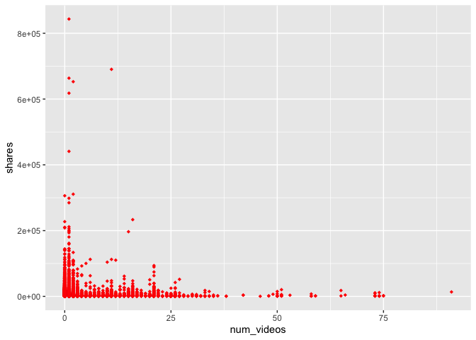
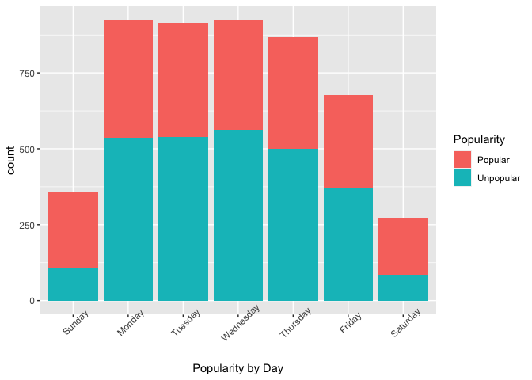

Project Two
================
Mary Brown and Jennifer Relihan
10/21/2021

## Data

### Read in the data and learn about the dimensions as well as different column names.

``` r
library(magrittr)
library(dplyr)
Data<-read.csv("OnlineNewsPopularity.csv")  
dim(Data)  
```

    ## [1] 39644    61

``` r
names(Data)  
```

    ##  [1] "url"                           "timedelta"                     "n_tokens_title"               
    ##  [4] "n_tokens_content"              "n_unique_tokens"               "n_non_stop_words"             
    ##  [7] "n_non_stop_unique_tokens"      "num_hrefs"                     "num_self_hrefs"               
    ## [10] "num_imgs"                      "num_videos"                    "average_token_length"         
    ## [13] "num_keywords"                  "data_channel_is_lifestyle"     "data_channel_is_entertainment"
    ## [16] "data_channel_is_bus"           "data_channel_is_socmed"        "data_channel_is_tech"         
    ## [19] "data_channel_is_world"         "kw_min_min"                    "kw_max_min"                   
    ## [22] "kw_avg_min"                    "kw_min_max"                    "kw_max_max"                   
    ## [25] "kw_avg_max"                    "kw_min_avg"                    "kw_max_avg"                   
    ## [28] "kw_avg_avg"                    "self_reference_min_shares"     "self_reference_max_shares"    
    ## [31] "self_reference_avg_sharess"    "weekday_is_monday"             "weekday_is_tuesday"           
    ## [34] "weekday_is_wednesday"          "weekday_is_thursday"           "weekday_is_friday"            
    ## [37] "weekday_is_saturday"           "weekday_is_sunday"             "is_weekend"                   
    ## [40] "LDA_00"                        "LDA_01"                        "LDA_02"                       
    ## [43] "LDA_03"                        "LDA_04"                        "global_subjectivity"          
    ## [46] "global_sentiment_polarity"     "global_rate_positive_words"    "global_rate_negative_words"   
    ## [49] "rate_positive_words"           "rate_negative_words"           "avg_positive_polarity"        
    ## [52] "min_positive_polarity"         "max_positive_polarity"         "avg_negative_polarity"        
    ## [55] "min_negative_polarity"         "max_negative_polarity"         "title_subjectivity"           
    ## [58] "title_sentiment_polarity"      "abs_title_subjectivity"        "abs_title_sentiment_polarity" 
    ## [61] "shares"

## Subset

### Subset the data by channels and create a vector of all of the channels we are interested in.

``` r
EntertainmentChannel <- Data %>% filter(data_channel_is_entertainment == TRUE) %>% select(-starts_with("data_channel_is_"))  

AllChannels <- Data %>% select(starts_with("data_channel_is_")) %>% names  
```

## Summary Statistics

### Here we produced some summary statistics and graphs of the data. First, we looked at a full summary on each column of our data. Next, we decided to specifically look further into total shares by days of the week. In order to do summaries on days of the week, we needed to gather the days/values by shares and filter by true values. The first summary shows the standard deviation, average, median, and IQR for each day of the week by shares. The second summary shows the same summary statistics for each day of the week by minimum amount of shares.

``` r
library(tidyverse)
summary(Data)  
```

    ##      url              timedelta     n_tokens_title n_tokens_content n_unique_tokens    n_non_stop_words   
    ##  Length:39644       Min.   :  8.0   Min.   : 2.0   Min.   :   0.0   Min.   :  0.0000   Min.   :   0.0000  
    ##  Class :character   1st Qu.:164.0   1st Qu.: 9.0   1st Qu.: 246.0   1st Qu.:  0.4709   1st Qu.:   1.0000  
    ##  Mode  :character   Median :339.0   Median :10.0   Median : 409.0   Median :  0.5392   Median :   1.0000  
    ##                     Mean   :354.5   Mean   :10.4   Mean   : 546.5   Mean   :  0.5482   Mean   :   0.9965  
    ##                     3rd Qu.:542.0   3rd Qu.:12.0   3rd Qu.: 716.0   3rd Qu.:  0.6087   3rd Qu.:   1.0000  
    ##                     Max.   :731.0   Max.   :23.0   Max.   :8474.0   Max.   :701.0000   Max.   :1042.0000  
    ##  n_non_stop_unique_tokens   num_hrefs      num_self_hrefs       num_imgs         num_videos    average_token_length
    ##  Min.   :  0.0000         Min.   :  0.00   Min.   :  0.000   Min.   :  0.000   Min.   : 0.00   Min.   :0.000       
    ##  1st Qu.:  0.6257         1st Qu.:  4.00   1st Qu.:  1.000   1st Qu.:  1.000   1st Qu.: 0.00   1st Qu.:4.478       
    ##  Median :  0.6905         Median :  8.00   Median :  3.000   Median :  1.000   Median : 0.00   Median :4.664       
    ##  Mean   :  0.6892         Mean   : 10.88   Mean   :  3.294   Mean   :  4.544   Mean   : 1.25   Mean   :4.548       
    ##  3rd Qu.:  0.7546         3rd Qu.: 14.00   3rd Qu.:  4.000   3rd Qu.:  4.000   3rd Qu.: 1.00   3rd Qu.:4.855       
    ##  Max.   :650.0000         Max.   :304.00   Max.   :116.000   Max.   :128.000   Max.   :91.00   Max.   :8.042       
    ##   num_keywords    data_channel_is_lifestyle data_channel_is_entertainment data_channel_is_bus data_channel_is_socmed
    ##  Min.   : 1.000   Min.   :0.00000           Min.   :0.000                 Min.   :0.0000      Min.   :0.0000        
    ##  1st Qu.: 6.000   1st Qu.:0.00000           1st Qu.:0.000                 1st Qu.:0.0000      1st Qu.:0.0000        
    ##  Median : 7.000   Median :0.00000           Median :0.000                 Median :0.0000      Median :0.0000        
    ##  Mean   : 7.224   Mean   :0.05295           Mean   :0.178                 Mean   :0.1579      Mean   :0.0586        
    ##  3rd Qu.: 9.000   3rd Qu.:0.00000           3rd Qu.:0.000                 3rd Qu.:0.0000      3rd Qu.:0.0000        
    ##  Max.   :10.000   Max.   :1.00000           Max.   :1.000                 Max.   :1.0000      Max.   :1.0000        
    ##  data_channel_is_tech data_channel_is_world   kw_min_min       kw_max_min       kw_avg_min        kw_min_max    
    ##  Min.   :0.0000       Min.   :0.0000        Min.   : -1.00   Min.   :     0   Min.   :   -1.0   Min.   :     0  
    ##  1st Qu.:0.0000       1st Qu.:0.0000        1st Qu.: -1.00   1st Qu.:   445   1st Qu.:  141.8   1st Qu.:     0  
    ##  Median :0.0000       Median :0.0000        Median : -1.00   Median :   660   Median :  235.5   Median :  1400  
    ##  Mean   :0.1853       Mean   :0.2126        Mean   : 26.11   Mean   :  1154   Mean   :  312.4   Mean   : 13612  
    ##  3rd Qu.:0.0000       3rd Qu.:0.0000        3rd Qu.:  4.00   3rd Qu.:  1000   3rd Qu.:  357.0   3rd Qu.:  7900  
    ##  Max.   :1.0000       Max.   :1.0000        Max.   :377.00   Max.   :298400   Max.   :42827.9   Max.   :843300  
    ##    kw_max_max       kw_avg_max       kw_min_avg     kw_max_avg       kw_avg_avg    self_reference_min_shares
    ##  Min.   :     0   Min.   :     0   Min.   :  -1   Min.   :     0   Min.   :    0   Min.   :     0           
    ##  1st Qu.:843300   1st Qu.:172847   1st Qu.:   0   1st Qu.:  3562   1st Qu.: 2382   1st Qu.:   639           
    ##  Median :843300   Median :244572   Median :1024   Median :  4356   Median : 2870   Median :  1200           
    ##  Mean   :752324   Mean   :259282   Mean   :1117   Mean   :  5657   Mean   : 3136   Mean   :  3999           
    ##  3rd Qu.:843300   3rd Qu.:330980   3rd Qu.:2057   3rd Qu.:  6020   3rd Qu.: 3600   3rd Qu.:  2600           
    ##  Max.   :843300   Max.   :843300   Max.   :3613   Max.   :298400   Max.   :43568   Max.   :843300           
    ##  self_reference_max_shares self_reference_avg_sharess weekday_is_monday weekday_is_tuesday weekday_is_wednesday
    ##  Min.   :     0            Min.   :     0.0           Min.   :0.000     Min.   :0.0000     Min.   :0.0000      
    ##  1st Qu.:  1100            1st Qu.:   981.2           1st Qu.:0.000     1st Qu.:0.0000     1st Qu.:0.0000      
    ##  Median :  2800            Median :  2200.0           Median :0.000     Median :0.0000     Median :0.0000      
    ##  Mean   : 10329            Mean   :  6401.7           Mean   :0.168     Mean   :0.1864     Mean   :0.1875      
    ##  3rd Qu.:  8000            3rd Qu.:  5200.0           3rd Qu.:0.000     3rd Qu.:0.0000     3rd Qu.:0.0000      
    ##  Max.   :843300            Max.   :843300.0           Max.   :1.000     Max.   :1.0000     Max.   :1.0000      
    ##  weekday_is_thursday weekday_is_friday weekday_is_saturday weekday_is_sunday   is_weekend         LDA_00       
    ##  Min.   :0.0000      Min.   :0.0000    Min.   :0.00000     Min.   :0.00000   Min.   :0.0000   Min.   :0.00000  
    ##  1st Qu.:0.0000      1st Qu.:0.0000    1st Qu.:0.00000     1st Qu.:0.00000   1st Qu.:0.0000   1st Qu.:0.02505  
    ##  Median :0.0000      Median :0.0000    Median :0.00000     Median :0.00000   Median :0.0000   Median :0.03339  
    ##  Mean   :0.1833      Mean   :0.1438    Mean   :0.06188     Mean   :0.06904   Mean   :0.1309   Mean   :0.18460  
    ##  3rd Qu.:0.0000      3rd Qu.:0.0000    3rd Qu.:0.00000     3rd Qu.:0.00000   3rd Qu.:0.0000   3rd Qu.:0.24096  
    ##  Max.   :1.0000      Max.   :1.0000    Max.   :1.00000     Max.   :1.00000   Max.   :1.0000   Max.   :0.92699  
    ##      LDA_01            LDA_02            LDA_03            LDA_04        global_subjectivity global_sentiment_polarity
    ##  Min.   :0.00000   Min.   :0.00000   Min.   :0.00000   Min.   :0.00000   Min.   :0.0000      Min.   :-0.39375         
    ##  1st Qu.:0.02501   1st Qu.:0.02857   1st Qu.:0.02857   1st Qu.:0.02857   1st Qu.:0.3962      1st Qu.: 0.05776         
    ##  Median :0.03334   Median :0.04000   Median :0.04000   Median :0.04073   Median :0.4535      Median : 0.11912         
    ##  Mean   :0.14126   Mean   :0.21632   Mean   :0.22377   Mean   :0.23403   Mean   :0.4434      Mean   : 0.11931         
    ##  3rd Qu.:0.15083   3rd Qu.:0.33422   3rd Qu.:0.37576   3rd Qu.:0.39999   3rd Qu.:0.5083      3rd Qu.: 0.17783         
    ##  Max.   :0.92595   Max.   :0.92000   Max.   :0.92653   Max.   :0.92719   Max.   :1.0000      Max.   : 0.72784         
    ##  global_rate_positive_words global_rate_negative_words rate_positive_words rate_negative_words avg_positive_polarity
    ##  Min.   :0.00000            Min.   :0.000000           Min.   :0.0000      Min.   :0.0000      Min.   :0.0000       
    ##  1st Qu.:0.02838            1st Qu.:0.009615           1st Qu.:0.6000      1st Qu.:0.1852      1st Qu.:0.3062       
    ##  Median :0.03902            Median :0.015337           Median :0.7105      Median :0.2800      Median :0.3588       
    ##  Mean   :0.03962            Mean   :0.016612           Mean   :0.6822      Mean   :0.2879      Mean   :0.3538       
    ##  3rd Qu.:0.05028            3rd Qu.:0.021739           3rd Qu.:0.8000      3rd Qu.:0.3846      3rd Qu.:0.4114       
    ##  Max.   :0.15549            Max.   :0.184932           Max.   :1.0000      Max.   :1.0000      Max.   :1.0000       
    ##  min_positive_polarity max_positive_polarity avg_negative_polarity min_negative_polarity max_negative_polarity
    ##  Min.   :0.00000       Min.   :0.0000        Min.   :-1.0000       Min.   :-1.0000       Min.   :-1.0000      
    ##  1st Qu.:0.05000       1st Qu.:0.6000        1st Qu.:-0.3284       1st Qu.:-0.7000       1st Qu.:-0.1250      
    ##  Median :0.10000       Median :0.8000        Median :-0.2533       Median :-0.5000       Median :-0.1000      
    ##  Mean   :0.09545       Mean   :0.7567        Mean   :-0.2595       Mean   :-0.5219       Mean   :-0.1075      
    ##  3rd Qu.:0.10000       3rd Qu.:1.0000        3rd Qu.:-0.1869       3rd Qu.:-0.3000       3rd Qu.:-0.0500      
    ##  Max.   :1.00000       Max.   :1.0000        Max.   : 0.0000       Max.   : 0.0000       Max.   : 0.0000      
    ##  title_subjectivity title_sentiment_polarity abs_title_subjectivity abs_title_sentiment_polarity     shares      
    ##  Min.   :0.0000     Min.   :-1.00000         Min.   :0.0000         Min.   :0.0000               Min.   :     1  
    ##  1st Qu.:0.0000     1st Qu.: 0.00000         1st Qu.:0.1667         1st Qu.:0.0000               1st Qu.:   946  
    ##  Median :0.1500     Median : 0.00000         Median :0.5000         Median :0.0000               Median :  1400  
    ##  Mean   :0.2824     Mean   : 0.07143         Mean   :0.3418         Mean   :0.1561               Mean   :  3395  
    ##  3rd Qu.:0.5000     3rd Qu.: 0.15000         3rd Qu.:0.5000         3rd Qu.:0.2500               3rd Qu.:  2800  
    ##  Max.   :1.0000     Max.   : 1.00000         Max.   :0.5000         Max.   :1.0000               Max.   :843300

``` r
Days <- Data %>% pivot_longer(starts_with("weekday_is"), names_to = "day", values_to = "data") %>% filter(data == TRUE) 

Summary1 <- Days %>% group_by(day) %>% summarize(std = sd(shares), average = mean(shares), median = median(shares), IQR = IQR(shares))  
print(Summary1)
```

    ## # A tibble: 7 × 5
    ##   day                     std average median   IQR
    ##   <chr>                 <dbl>   <dbl>  <dbl> <dbl>
    ## 1 weekday_is_friday     8149.   3285.   1500 1726 
    ## 2 weekday_is_monday    14691.   3647.   1400 1781 
    ## 3 weekday_is_saturday  14231.   4078.   2000 2300 
    ## 4 weekday_is_sunday     6215.   3747.   1900 2500 
    ## 5 weekday_is_thursday   9436.   3179.   1400 1698 
    ## 6 weekday_is_tuesday    9798.   3203.   1300 1603 
    ## 7 weekday_is_wednesday 14588.   3303.   1300 1712.

``` r
Summary2 <- Days %>% group_by(day) %>% summarize(std = sd(kw_min_min), average = mean(kw_min_min), median = median(kw_min_min), IQR = IQR(kw_min_min))  
print(Summary2)
```

    ## # A tibble: 7 × 5
    ##   day                    std average median   IQR
    ##   <chr>                <dbl>   <dbl>  <dbl> <dbl>
    ## 1 weekday_is_friday     70.1    26.5     -1     5
    ## 2 weekday_is_monday     70.0    26.3     -1     5
    ## 3 weekday_is_saturday   65.3    22.8     -1     5
    ## 4 weekday_is_sunday     71.8    27.9     -1     5
    ## 5 weekday_is_thursday   70.5    26.9     -1     5
    ## 6 weekday_is_tuesday    67.9    24.7     -1     5
    ## 7 weekday_is_wednesday  70.4    26.8     -1     5

## Section for Plots

``` r
library(ggplot2)  
library(scales)
Videos <- ggplot(Data, aes(x = num_videos, y= shares)) + geom_point(shape = 18, color = "red")  
print(Videos)  
```

<!-- -->

``` r
Images <- ggplot(Data, aes(x = num_imgs, y = shares)) + geom_bar(stat = "identity", fill = "steelblue") + xlim(0,20) + scale_y_continuous(labels = unit_format(unit = "M", scale = 5e-6)) + ggtitle("Shares by Images") + labs(y = "Shares", x = "Number of Images", caption = "This view shows the number of images filtered from 0 to 20.") + theme(plot.caption = element_text(hjust =0))
print(Images)
```

<!-- -->

## Splitting the data

### In this section we split the data - 70% train and 30% test

``` r
library(caret)
DataIndex<-createDataPartition(y = Data$shares, p = 0.7, list = FALSE)  
TrainData <- Data[DataIndex,]  
TestData <- Data[-DataIndex,]  
```
