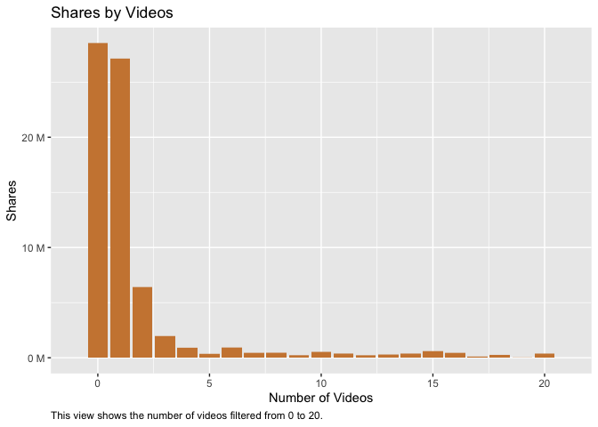
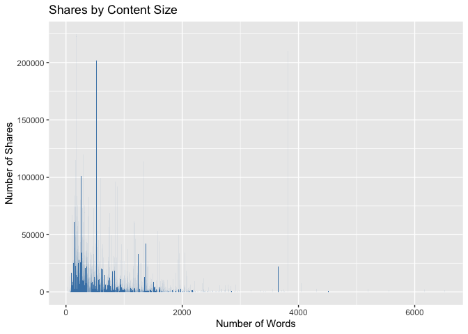
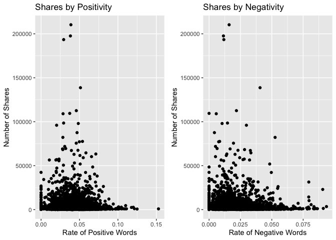

Project Two
================
Mary Brown and Jennifer Relihan
10/21/2021

## Data Manipulation

=======

## Introduction

## Required to run this document

``` r
library(tidyverse)  
library(caret)  
library(ggplot2)  
library(ggpubr)  
library(magrittr)  
library(scales)
library(corrplot)  
library(GDAtools)
```

## Data Manipulation

``` r
# Here we read in the data and learn more about the dimensions as well as different column names.
Data<-read.csv("OnlineNewsPopularity.csv")  
dim(Data)  
```

    ## [1] 39644    61

``` r
names(Data)  
```

    ##  [1] "url"                           "timedelta"                     "n_tokens_title"               
    ##  [4] "n_tokens_content"              "n_unique_tokens"               "n_non_stop_words"             
    ##  [7] "n_non_stop_unique_tokens"      "num_hrefs"                     "num_self_hrefs"               
    ## [10] "num_imgs"                      "num_videos"                    "average_token_length"         
    ## [13] "num_keywords"                  "data_channel_is_lifestyle"     "data_channel_is_entertainment"
    ## [16] "data_channel_is_bus"           "data_channel_is_socmed"        "data_channel_is_tech"         
    ## [19] "data_channel_is_world"         "kw_min_min"                    "kw_max_min"                   
    ## [22] "kw_avg_min"                    "kw_min_max"                    "kw_max_max"                   
    ## [25] "kw_avg_max"                    "kw_min_avg"                    "kw_max_avg"                   
    ## [28] "kw_avg_avg"                    "self_reference_min_shares"     "self_reference_max_shares"    
    ## [31] "self_reference_avg_sharess"    "weekday_is_monday"             "weekday_is_tuesday"           
    ## [34] "weekday_is_wednesday"          "weekday_is_thursday"           "weekday_is_friday"            
    ## [37] "weekday_is_saturday"           "weekday_is_sunday"             "is_weekend"                   
    ## [40] "LDA_00"                        "LDA_01"                        "LDA_02"                       
    ## [43] "LDA_03"                        "LDA_04"                        "global_subjectivity"          
    ## [46] "global_sentiment_polarity"     "global_rate_positive_words"    "global_rate_negative_words"   
    ## [49] "rate_positive_words"           "rate_negative_words"           "avg_positive_polarity"        
    ## [52] "min_positive_polarity"         "max_positive_polarity"         "avg_negative_polarity"        
    ## [55] "min_negative_polarity"         "max_negative_polarity"         "title_subjectivity"           
    ## [58] "title_sentiment_polarity"      "abs_title_subjectivity"        "abs_title_sentiment_polarity" 
    ## [61] "shares"

``` r
str(Data)  
```

    ## 'data.frame':    39644 obs. of  61 variables:
    ##  $ url                          : chr  "http://mashable.com/2013/01/07/amazon-instant-video-browser/" "http://mashable.com/2013/01/07/ap-samsung-sponsored-tweets/" "http://mashable.com/2013/01/07/apple-40-billion-app-downloads/" "http://mashable.com/2013/01/07/astronaut-notre-dame-bcs/" ...
    ##  $ timedelta                    : num  731 731 731 731 731 731 731 731 731 731 ...
    ##  $ n_tokens_title               : num  12 9 9 9 13 10 8 12 11 10 ...
    ##  $ n_tokens_content             : num  219 255 211 531 1072 ...
    ##  $ n_unique_tokens              : num  0.664 0.605 0.575 0.504 0.416 ...
    ##  $ n_non_stop_words             : num  1 1 1 1 1 ...
    ##  $ n_non_stop_unique_tokens     : num  0.815 0.792 0.664 0.666 0.541 ...
    ##  $ num_hrefs                    : num  4 3 3 9 19 2 21 20 2 4 ...
    ##  $ num_self_hrefs               : num  2 1 1 0 19 2 20 20 0 1 ...
    ##  $ num_imgs                     : num  1 1 1 1 20 0 20 20 0 1 ...
    ##  $ num_videos                   : num  0 0 0 0 0 0 0 0 0 1 ...
    ##  $ average_token_length         : num  4.68 4.91 4.39 4.4 4.68 ...
    ##  $ num_keywords                 : num  5 4 6 7 7 9 10 9 7 5 ...
    ##  $ data_channel_is_lifestyle    : num  0 0 0 0 0 0 1 0 0 0 ...
    ##  $ data_channel_is_entertainment: num  1 0 0 1 0 0 0 0 0 0 ...
    ##  $ data_channel_is_bus          : num  0 1 1 0 0 0 0 0 0 0 ...
    ##  $ data_channel_is_socmed       : num  0 0 0 0 0 0 0 0 0 0 ...
    ##  $ data_channel_is_tech         : num  0 0 0 0 1 1 0 1 1 0 ...
    ##  $ data_channel_is_world        : num  0 0 0 0 0 0 0 0 0 1 ...
    ##  $ kw_min_min                   : num  0 0 0 0 0 0 0 0 0 0 ...
    ##  $ kw_max_min                   : num  0 0 0 0 0 0 0 0 0 0 ...
    ##  $ kw_avg_min                   : num  0 0 0 0 0 0 0 0 0 0 ...
    ##  $ kw_min_max                   : num  0 0 0 0 0 0 0 0 0 0 ...
    ##  $ kw_max_max                   : num  0 0 0 0 0 0 0 0 0 0 ...
    ##  $ kw_avg_max                   : num  0 0 0 0 0 0 0 0 0 0 ...
    ##  $ kw_min_avg                   : num  0 0 0 0 0 0 0 0 0 0 ...
    ##  $ kw_max_avg                   : num  0 0 0 0 0 0 0 0 0 0 ...
    ##  $ kw_avg_avg                   : num  0 0 0 0 0 0 0 0 0 0 ...
    ##  $ self_reference_min_shares    : num  496 0 918 0 545 8500 545 545 0 0 ...
    ##  $ self_reference_max_shares    : num  496 0 918 0 16000 8500 16000 16000 0 0 ...
    ##  $ self_reference_avg_sharess   : num  496 0 918 0 3151 ...
    ##  $ weekday_is_monday            : num  1 1 1 1 1 1 1 1 1 1 ...
    ##  $ weekday_is_tuesday           : num  0 0 0 0 0 0 0 0 0 0 ...
    ##  $ weekday_is_wednesday         : num  0 0 0 0 0 0 0 0 0 0 ...
    ##  $ weekday_is_thursday          : num  0 0 0 0 0 0 0 0 0 0 ...
    ##  $ weekday_is_friday            : num  0 0 0 0 0 0 0 0 0 0 ...
    ##  $ weekday_is_saturday          : num  0 0 0 0 0 0 0 0 0 0 ...
    ##  $ weekday_is_sunday            : num  0 0 0 0 0 0 0 0 0 0 ...
    ##  $ is_weekend                   : num  0 0 0 0 0 0 0 0 0 0 ...
    ##  $ LDA_00                       : num  0.5003 0.7998 0.2178 0.0286 0.0286 ...
    ##  $ LDA_01                       : num  0.3783 0.05 0.0333 0.4193 0.0288 ...
    ##  $ LDA_02                       : num  0.04 0.0501 0.0334 0.4947 0.0286 ...
    ##  $ LDA_03                       : num  0.0413 0.0501 0.0333 0.0289 0.0286 ...
    ##  $ LDA_04                       : num  0.0401 0.05 0.6822 0.0286 0.8854 ...
    ##  $ global_subjectivity          : num  0.522 0.341 0.702 0.43 0.514 ...
    ##  $ global_sentiment_polarity    : num  0.0926 0.1489 0.3233 0.1007 0.281 ...
    ##  $ global_rate_positive_words   : num  0.0457 0.0431 0.0569 0.0414 0.0746 ...
    ##  $ global_rate_negative_words   : num  0.0137 0.01569 0.00948 0.02072 0.01213 ...
    ##  $ rate_positive_words          : num  0.769 0.733 0.857 0.667 0.86 ...
    ##  $ rate_negative_words          : num  0.231 0.267 0.143 0.333 0.14 ...
    ##  $ avg_positive_polarity        : num  0.379 0.287 0.496 0.386 0.411 ...
    ##  $ min_positive_polarity        : num  0.1 0.0333 0.1 0.1364 0.0333 ...
    ##  $ max_positive_polarity        : num  0.7 0.7 1 0.8 1 0.6 1 1 0.8 0.5 ...
    ##  $ avg_negative_polarity        : num  -0.35 -0.119 -0.467 -0.37 -0.22 ...
    ##  $ min_negative_polarity        : num  -0.6 -0.125 -0.8 -0.6 -0.5 -0.4 -0.5 -0.5 -0.125 -0.5 ...
    ##  $ max_negative_polarity        : num  -0.2 -0.1 -0.133 -0.167 -0.05 ...
    ##  $ title_subjectivity           : num  0.5 0 0 0 0.455 ...
    ##  $ title_sentiment_polarity     : num  -0.188 0 0 0 0.136 ...
    ##  $ abs_title_subjectivity       : num  0 0.5 0.5 0.5 0.0455 ...
    ##  $ abs_title_sentiment_polarity : num  0.188 0 0 0 0.136 ...
    ##  $ shares                       : int  593 711 1500 1200 505 855 556 891 3600 710 ...

``` r
# After reviewing the attributes information on the website, we need to remove the non-predictive variables which are URL and Time Delta. Then, we need to subset the data by channels.  
Data <- Data %>% select(-url, -timedelta)  
EntertainmentChannel <- Data %>% filter(data_channel_is_entertainment == TRUE) %>% select(-starts_with("data_channel_is_"))  

# Check for any missing values  
sum(is.na(Data))  
```

    ## [1] 0

``` r
# In order to work with days of the week, we created a column that shows all of the days of the week by shares.  
Days = c('Sunday', 'Monday', 'Tuesday', 'Wednesday', 'Thursday', 'Friday', 'Saturday')  
EntertainmentChannel<- EntertainmentChannel %>% mutate(weekday = ifelse(weekday_is_monday==1, 'Monday',  
                                    ifelse(weekday_is_tuesday==1, 'Tuesday',   
                                    ifelse(weekday_is_wednesday==1, "Wednesday", 
                                    ifelse(weekday_is_thursday==1, "Thursday",
                                    ifelse(weekday_is_friday==1, "Friday",
                                    ifelse(weekday_is_saturday==1, "Saturday", "Sunday"  
                                           ))))))) %>% mutate(weekday = factor(weekday, levels = Days))  

# We would like to create a popularity column by shares for future analysis. This popularity column will rate by either "Popular" or "Unpopular." To do this, we found the median value for the amount of shares. 
ShareSummary <- EntertainmentChannel %>% summarize(median = median(shares))  
EntertainmentChannel <- EntertainmentChannel %>% mutate(Popularity = ifelse(shares>1200, "Popular","Unpopular"))  

# Before doing any exploratory data analysis (EDA), we need to split the data -70% train and 30% test.
NumericData <- dplyr::select_if(EntertainmentChannel, is.numeric)
set.seed(123)
DataIndex<-createDataPartition(y = EntertainmentChannel$shares, p = 0.7, list = FALSE)  
TrainData <- EntertainmentChannel[DataIndex,]
TestData <- EntertainmentChannel[-DataIndex,]  
dim(TrainData)  
```

    ## [1] 4941   55

``` r
dim(TestData)
```

    ## [1] 2116   55

## Exploratory Data Analysis

``` r
# This table shows summary statistics for our 'shares' data point. 
SharesStats <- TrainData %>% summarize(Avg = mean(shares), Median = median(shares), STDV = sd(shares), IQR = IQR(shares))
knitr::kable(SharesStats, caption = "Summary Statistics on Shares", digits = 0)
```

|  Avg | Median | STDV |  IQR |
|-----:|-------:|-----:|-----:|
| 2958 |   1200 | 8041 | 1267 |

Summary Statistics on Shares

``` r
# This table shows the summary statistics for shares by weekday. 
Weekdays <- TrainData %>% group_by(weekday) %>% summarise(Avg = round(mean(shares)), Maximum = round(max(shares)), Minimum = round(min(shares))) 
knitr::kable(Weekdays, caption = "Summary Statistics on Shares by Weekdays", digits = 2)  
```

| weekday   |  Avg | Maximum | Minimum |
|:----------|-----:|--------:|--------:|
| Sunday    | 3998 |   69500 |     171 |
| Monday    | 3017 |  112600 |      59 |
| Tuesday   | 2567 |   98000 |      47 |
| Wednesday | 2646 |  109500 |      84 |
| Thursday  | 2989 |  197600 |      57 |
| Friday    | 3133 |  210300 |      58 |
| Saturday  | 3227 |   68300 |      65 |

Summary Statistics on Shares by Weekdays

``` r
# Showing popularity for the days of the week. A designation of Popular is when the number of shares is greater than 1200, and less than 1200 is considered Unpopular.
weekday_popularity <- table(TrainData$weekday, TrainData$Popularity)
weekday_popularity
```

    ##            
    ##             Popular Unpopular
    ##   Sunday        253       107
    ##   Monday        388       537
    ##   Tuesday       377       538
    ##   Wednesday     362       562
    ##   Thursday      369       500
    ##   Friday        308       369
    ##   Saturday      186        85

``` r
# Showing popularity for weekdays vs weekends.For the y-axis column 0 = weekday and 1 = weekend. Here we can summarize popularity of content based on if it was shared over the weekend or during the week. 
is_weekend_pop <- table(TrainData$is_weekend, TrainData$Popularity)
is_weekend_pop
```

    ##    
    ##     Popular Unpopular
    ##   0    1804      2506
    ##   1     439       192

``` r
# This is a table displaying the average number of shares of referenced articles in mashable, by weekday. 
GDAtools::wtable(TrainData$weekday, w = TrainData$self_reference_avg_sharess)
```

    ##    Sunday    Monday   Tuesday Wednesday  Thursday    Friday  Saturday       Sum 
    ##   2083460   4435183   4558103   4650613   4058313   3396717   1529891  24712280

``` r
# This is a table displaying average keywords on certain days of the week  
Keywords <- TrainData %>% group_by(weekday) %>% summarise(Average = mean(self_reference_avg_sharess), Median = median(self_reference_avg_sharess), STDV = sd(self_reference_avg_sharess), IQR = IQR(self_reference_avg_sharess))  
knitr::kable(Keywords, caption = "Summary statistics of average shares of referenced articles by specific days of the week", digits = 2)
```

| weekday   | Average |  Median |     STDV |     IQR |
|:----------|--------:|--------:|---------:|--------:|
| Sunday    | 5787.39 | 2346.90 | 12943.85 | 3825.00 |
| Monday    | 4794.79 | 1933.33 | 14369.15 | 3355.50 |
| Tuesday   | 4981.53 | 2100.00 |  8711.15 | 4193.80 |
| Wednesday | 5033.13 | 2029.07 | 10070.74 | 4019.50 |
| Thursday  | 4670.10 | 2066.67 |  8952.19 | 3862.83 |
| Friday    | 5017.31 | 2000.00 | 10974.97 | 3950.50 |
| Saturday  | 5645.35 | 2118.33 | 19230.65 | 3757.42 |

Summary statistics of average shares of referenced articles by specific
days of the week

### Plots

``` r
# Plot 1: 
# This plot displays the number of shares by weekday. 
DaysPlot <- TrainData %>% ggplot(aes(x = weekday, y = shares)) + geom_bar(stat = "identity", fill = "steelblue") + scale_y_continuous(labels = unit_format(unit = "M", scale = 5e-6)) + ggtitle("Shares by Days of the Week") + labs(y = "Shares", x = "Days of the Week") + theme(axis.text.x = element_text(angle = 45))
print(DaysPlot)  
```

<!-- -->

``` r
# Plot 2:
# This plot displays the popularity of shares by days of the week.
PopularityPlot <- TrainData %>% ggplot(aes(x = weekday)) + geom_bar(aes(fill = as.factor(Popularity))) + labs(x = "Popularity by Day") + theme(axis.text.x = element_text(angle = 45)) + scale_fill_discrete(name = "Popularity")  
print(PopularityPlot)
```

<!-- -->

``` r
# Plot 3:
# This plot displays shares by the number of Videos.
Videos <- TrainData %>% ggplot(aes(x = num_videos, y = shares)) + geom_bar(stat = "identity", fill = "tan3") + xlim(-1,21) + scale_y_continuous(labels = unit_format(unit = "M", scale = 5e-6)) + ggtitle("Shares by Videos") + labs(y = "Shares", x = "Number of Videos", caption = "This view shows the number of videos filtered from 0 to 20.") + theme(plot.caption = element_text(hjust = 0))  
print(Videos)  
```

<!-- -->

``` r
# Plot 4:
# This plot displays shares by the number of images. 
Images <- TrainData %>% ggplot(aes(x = num_imgs, y = shares)) + geom_bar(stat = "identity", fill = "steelblue") + xlim(-1,21) + scale_y_continuous(labels = unit_format(unit = "M", scale = 5e-6)) + ggtitle("Shares by Images") + labs(y = "Shares", x = "Number of Images", caption = "This view shows the number of images filtered from 0 to 20.") + theme(plot.caption = element_text(hjust =0))
print(Images) 
```

<!-- -->

``` r
# Plot 5:
# This changes word content 0 values to NA. We do this because we want to see the articles with words and how many shares they get. The 0 values had a lot more shares but are comprised of videos or photos with no words.
TrainData$n_tokens_content[TrainData$n_tokens_content == 0] <- NA
# The number of shares based on the number of words in the content to review how this effects shares.
Num_words <- ggplot(TrainData, aes(x=n_tokens_content, y=shares))+ geom_bar(stat = "identity", fill="steelblue") + labs(y="Number of Shares", x="Number of Words") + ggtitle("Shares by Content Size") + theme(plot.caption = element_text(hjust =0))
# Here you can review the trend of shares as a function of the size or word count of an article.
Num_words
```

<!-- -->

``` r
# Plot 6:
# Here we are exploring how the rate of positive words in an article effect the amount of shares
positivity <- ggplot(TrainData, aes(x=global_rate_positive_words, y=shares))+ geom_point(stat = "identity", fill="steelblue") + labs(y="Number of Shares", x="Rate of Positive Words") + ggtitle("Shares by Positivity") + theme(plot.caption = element_text(hjust =0))
positivity
```

<!-- -->

``` r
# Plot 7:
# Here we are exploring how the rate of negative words in an article effect the amount of shares
negativity <- ggplot(TrainData, aes(x=global_rate_negative_words, y=shares))+ geom_point(stat = "identity", fill="steelblue") + labs(y="Number of Shares", x="Rate of Negative Words") + ggtitle("Shares by Negativity") + theme(plot.caption = element_text(hjust =0))
negativity
```

<!-- -->

``` r
# Putting Plots 4 and 5 together to review side by side.Here you can review the shares by the rate of positive or negative content. Another point of review is to look at the rate of positive or negative words based off of the channel type. For instance, entertainment articles have a max rate of 0.10 positive content and a max rate of 0.093 for negative words in this training data set. We can see that the site Mashable tends to write more positive content for entertainment.
pos_neg_join <- ggpubr::ggarrange(positivity, negativity,ncol=2)
pos_neg_join
```

<!-- -->

## Linear Regression Models

### Supervised learning includes regression models, tree based methods, and k nearest neighbors. The basic linear regression model includes a response, a value of our explanatory variable for the ith observation, the y-intercept, and the slope. The model aims to show a linear approach for modeling the relationship between predictors and some response. The model is fit by minimizing the sum of squared residuals, which is equivalent to assuming normality on errors and using maximum liklihood to estimate the beta’s. In R, the basic linear model fits done with lm(). When utilizing lm() in R, statistical analysis can be found using anova() or summary().

``` r
# A summary on the full model shows predictors with significant p-values. I selected predictors with significant p-values to further explore for my linear regression model.  
FullData <- lm(shares~., data = TrainData)  
summary(FullData) 
```

    ## 
    ## Call:
    ## lm(formula = shares ~ ., data = TrainData)
    ## 
    ## Residuals:
    ##    Min     1Q Median     3Q    Max 
    ## -29936  -2470   -398    767 201109 
    ## 
    ## Coefficients: (11 not defined because of singularities)
    ##                                Estimate Std. Error t value Pr(>|t|)    
    ## (Intercept)                   2.614e+02  3.603e+03   0.073  0.94216    
    ## n_tokens_title               -9.798e+00  5.413e+01  -0.181  0.85637    
    ## n_tokens_content              1.691e+00  3.856e-01   4.386 1.18e-05 ***
    ## n_unique_tokens               1.060e+04  3.623e+03   2.925  0.00346 ** 
    ## n_non_stop_words                     NA         NA      NA       NA    
    ## n_non_stop_unique_tokens     -6.688e+03  3.103e+03  -2.156  0.03116 *  
    ## num_hrefs                     6.602e+00  9.836e+00   0.671  0.50212    
    ## num_self_hrefs               -1.031e+02  4.181e+01  -2.467  0.01367 *  
    ## num_imgs                     -1.750e+01  1.313e+01  -1.332  0.18289    
    ## num_videos                   -2.136e+01  2.050e+01  -1.042  0.29765    
    ## average_token_length          3.165e+02  4.777e+02   0.663  0.50767    
    ## num_keywords                 -1.450e+02  6.971e+01  -2.080  0.03757 *  
    ## kw_min_min                    5.127e+00  3.433e+00   1.494  0.13536    
    ## kw_max_min                    1.365e+00  1.359e-01  10.047  < 2e-16 ***
    ## kw_avg_min                   -5.536e+00  6.857e-01  -8.073 8.63e-16 ***
    ## kw_min_max                   -7.995e-03  4.168e-03  -1.918  0.05513 .  
    ## kw_max_max                   -1.227e-04  1.206e-03  -0.102  0.91895    
    ## kw_avg_max                    9.785e-05  1.923e-03   0.051  0.95943    
    ## kw_min_avg                   -1.150e-01  1.571e-01  -0.732  0.46407    
    ## kw_max_avg                    1.317e-01  5.934e-02   2.219  0.02652 *  
    ## kw_avg_avg                    4.876e-01  2.952e-01   1.652  0.09863 .  
    ## self_reference_min_shares     2.440e-03  2.466e-02   0.099  0.92121    
    ## self_reference_max_shares     6.438e-03  8.510e-03   0.757  0.44937    
    ## self_reference_avg_sharess    4.345e-03  2.529e-02   0.172  0.86356    
    ## weekday_is_monday             5.508e+02  4.811e+02   1.145  0.25229    
    ## weekday_is_tuesday            2.139e+02  4.829e+02   0.443  0.65777    
    ## weekday_is_wednesday          3.885e+02  4.839e+02   0.803  0.42210    
    ## weekday_is_thursday           4.010e+02  4.850e+02   0.827  0.40841    
    ## weekday_is_friday             4.395e+02  5.024e+02   0.875  0.38175    
    ## weekday_is_saturday          -5.241e+02  6.165e+02  -0.850  0.39528    
    ## weekday_is_sunday                    NA         NA      NA       NA    
    ## is_weekend                           NA         NA      NA       NA    
    ## LDA_00                       -1.360e+03  1.673e+03  -0.813  0.41645    
    ## LDA_01                        6.492e+02  1.234e+03   0.526  0.59900    
    ## LDA_02                       -1.256e+03  1.441e+03  -0.872  0.38349    
    ## LDA_03                        1.745e+02  1.231e+03   0.142  0.88733    
    ## LDA_04                               NA         NA      NA       NA    
    ## global_subjectivity           3.160e+03  1.573e+03   2.009  0.04455 *  
    ## global_sentiment_polarity     5.475e+03  3.113e+03   1.759  0.07865 .  
    ## global_rate_positive_words   -1.785e+04  1.439e+04  -1.240  0.21491    
    ## global_rate_negative_words   -1.423e+01  2.452e+04  -0.001  0.99954    
    ## rate_positive_words          -1.214e+03  2.187e+03  -0.555  0.57865    
    ## rate_negative_words                  NA         NA      NA       NA    
    ## avg_positive_polarity        -6.555e+02  2.495e+03  -0.263  0.79275    
    ## min_positive_polarity        -1.005e+03  2.203e+03  -0.456  0.64833    
    ## max_positive_polarity        -1.593e+02  8.161e+02  -0.195  0.84523    
    ## avg_negative_polarity        -6.739e+02  2.213e+03  -0.304  0.76080    
    ## min_negative_polarity        -2.937e+00  7.942e+02  -0.004  0.99705    
    ## max_negative_polarity         7.658e+02  1.841e+03   0.416  0.67751    
    ## title_subjectivity           -1.156e+02  4.860e+02  -0.238  0.81204    
    ## title_sentiment_polarity     -3.067e+02  4.337e+02  -0.707  0.47952    
    ## abs_title_subjectivity        3.577e+02  6.552e+02   0.546  0.58519    
    ## abs_title_sentiment_polarity  1.538e+03  6.863e+02   2.241  0.02508 *  
    ## weekdayMonday                        NA         NA      NA       NA    
    ## weekdayTuesday                       NA         NA      NA       NA    
    ## weekdayWednesday                     NA         NA      NA       NA    
    ## weekdayThursday                      NA         NA      NA       NA    
    ## weekdayFriday                        NA         NA      NA       NA    
    ## weekdaySaturday                      NA         NA      NA       NA    
    ## PopularityUnpopular          -4.360e+03  2.265e+02 -19.247  < 2e-16 ***
    ## ---
    ## Signif. codes:  0 '***' 0.001 '**' 0.01 '*' 0.05 '.' 0.1 ' ' 1
    ## 
    ## Residual standard error: 7472 on 4753 degrees of freedom
    ##   (139 observations deleted due to missingness)
    ## Multiple R-squared:  0.1562, Adjusted R-squared:  0.1477 
    ## F-statistic: 18.34 on 48 and 4753 DF,  p-value: < 2.2e-16

``` r
# This is the model I chose with some significant predictors 
Model1<-as.formula("shares ~ n_unique_tokens + kw_max_min + kw_avg_min + n_non_stop_unique_tokens + num_self_hrefs + num_keywords + kw_min_max + kw_max_avg + global_subjectivity + abs_title_sentiment_polarity + n_tokens_title + global_sentiment_polarity")  

# Fitting the model with the training data 
fit1 <- train(Model1, data = TrainData, 
              method = "lm",  
              preProcess = c("center", "scale"),  
              trControl = trainControl(method = "cv", number = 10))  

# Making a table of the results from the first linear model 
Results <- data.frame(t(fit1$results))  
colnames(Results) <- "Model Results"
knitr::kable(Results, digits = 3)  
```

|            | Model Results |
|:-----------|--------------:|
| intercept  |         1.000 |
| RMSE       |      7982.892 |
| Rsquared   |         0.033 |
| MAE        |      2935.816 |
| RMSESD     |      2045.516 |
| RsquaredSD |         0.058 |
| MAESD      |       201.116 |

``` r
# View Results
Results
```

    ##            Model Results
    ## intercept   1.000000e+00
    ## RMSE        7.982892e+03
    ## Rsquared    3.335327e-02
    ## MAE         2.935816e+03
    ## RMSESD      2.045516e+03
    ## RsquaredSD  5.790696e-02
    ## MAESD       2.011159e+02

``` r
# Linear Regression Model 2:

# After talking with a subject matter expert on marketing we discussed the columns available in the data set and which ones they may be most interested in seeing in a model to predict shares. 

# Fitting the model with the training data.  
fit2 <- train(shares ~weekday + global_rate_positive_words + global_rate_negative_words + title_sentiment_polarity,  
              data = TrainData,  
              method = "lm",   
              preProcess = c("center", "scale"),  
              trControl = trainControl(method = "cv", number = 10))  

# Putting together the results of Model 2
results <- data.frame(t(fit2$results))  
colnames(results) <- "Model Results"  
knitr::kable(results, digits = 3)  
```

|            | Model Results |
|:-----------|--------------:|
| intercept  |         1.000 |
| RMSE       |      7368.580 |
| Rsquared   |         0.002 |
| MAE        |      2920.813 |
| RMSESD     |      3402.365 |
| RsquaredSD |         0.003 |
| MAESD      |       436.673 |

``` r
# View results  
results  
```

    ##            Model Results
    ## intercept   1.000000e+00
    ## RMSE        7.368580e+03
    ## Rsquared    2.150332e-03
    ## MAE         2.920813e+03
    ## RMSESD      3.402365e+03
    ## RsquaredSD  3.138260e-03
    ## MAESD       4.366735e+02

``` r
# Putting both Linear Regression models together  
lmr_results <- data.frame(t(fit1$results), t(fit2$results))  
names(lmr_results)[1] <- "Model 1 Results"  
names(lmr_results)[2] <- "Model 2 Results"  
knitr::kable(lmr_results, digits = 3)  
```

|            | Model 1 Results | Model 2 Results |
|:-----------|----------------:|----------------:|
| intercept  |           1.000 |           1.000 |
| RMSE       |        7982.892 |        7368.580 |
| Rsquared   |           0.033 |           0.002 |
| MAE        |        2935.816 |        2920.813 |
| RMSESD     |        2045.516 |        3402.365 |
| RsquaredSD |           0.058 |           0.003 |
| MAESD      |         201.116 |         436.673 |

``` r
# View results  
lmr_results
```

    ##            Model 1 Results Model 2 Results
    ## intercept     1.000000e+00    1.000000e+00
    ## RMSE          7.982892e+03    7.368580e+03
    ## Rsquared      3.335327e-02    2.150332e-03
    ## MAE           2.935816e+03    2.920813e+03
    ## RMSESD        2.045516e+03    3.402365e+03
    ## RsquaredSD    5.790696e-02    3.138260e-03
    ## MAESD         2.011159e+02    4.366735e+02

## Random Forest Model

### My explanation will go here

``` r
TrainData[is.na(TrainData)] = 0
rfFit <- train(shares ~.,   
               data = TrainData, 
               method = "rf",  
               preProcess = c("center", "scale"),  
               trControl = trainControl(method = "repeatedcv", number = 5, repeats = 3),  
               tuneGrid = data.frame(mtry = seq(1,10,1)))  

rfFit$results
```

    ##    mtry     RMSE   Rsquared      MAE   RMSESD RsquaredSD    MAESD
    ## 1     1 7781.240 0.06100307 2749.640 1157.281 0.02186665 117.4812
    ## 2     2 7694.554 0.07406643 2678.867 1153.050 0.02377769 131.6007
    ## 3     3 7672.960 0.07927831 2637.817 1132.841 0.02536711 132.4770
    ## 4     4 7664.694 0.08169573 2616.303 1128.780 0.02702173 128.3320
    ## 5     5 7646.672 0.08785450 2586.561 1105.437 0.02777586 129.7702
    ## 6     6 7661.076 0.08751181 2564.491 1101.612 0.02880437 137.0012
    ## 7     7 7684.233 0.08743555 2556.221 1085.422 0.03066177 135.4831
    ## 8     8 7674.473 0.08937341 2542.526 1080.345 0.02897009 131.1469
    ## 9     9 7694.630 0.08925971 2534.873 1062.529 0.02912694 129.7102
    ## 10   10 7715.025 0.08893520 2530.377 1057.248 0.02898904 127.9736

\`\`\`
