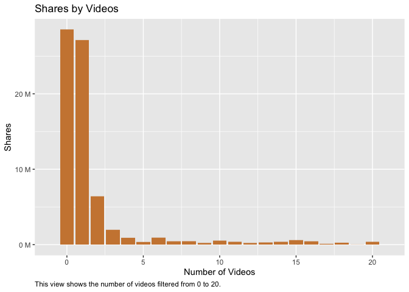
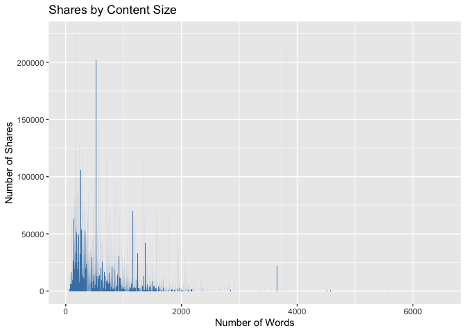
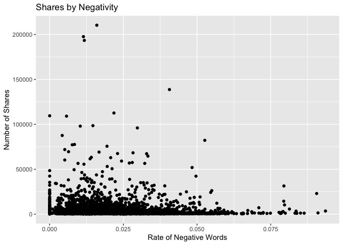

Project Two
================
Mary Brown and Jennifer Relihan
10/21/2021

## Data Manipulation

=======

## Introduction

## Required to run this document

``` r
library(tidyverse)  
library(caret)  
library(ggplot2)  
library(ggpubr)  
library(magrittr)  
library(scales)
library(corrplot)  
library(GDAtools)
```

## Data Manipulation

``` r
# Here we read in the data and learn more about the dimensions as well as different column names.
Data<-read.csv("OnlineNewsPopularity.csv")  
dim(Data)  
```

    ## [1] 39644    61

``` r
names(Data)  
```

    ##  [1] "url"                           "timedelta"                     "n_tokens_title"               
    ##  [4] "n_tokens_content"              "n_unique_tokens"               "n_non_stop_words"             
    ##  [7] "n_non_stop_unique_tokens"      "num_hrefs"                     "num_self_hrefs"               
    ## [10] "num_imgs"                      "num_videos"                    "average_token_length"         
    ## [13] "num_keywords"                  "data_channel_is_lifestyle"     "data_channel_is_entertainment"
    ## [16] "data_channel_is_bus"           "data_channel_is_socmed"        "data_channel_is_tech"         
    ## [19] "data_channel_is_world"         "kw_min_min"                    "kw_max_min"                   
    ## [22] "kw_avg_min"                    "kw_min_max"                    "kw_max_max"                   
    ## [25] "kw_avg_max"                    "kw_min_avg"                    "kw_max_avg"                   
    ## [28] "kw_avg_avg"                    "self_reference_min_shares"     "self_reference_max_shares"    
    ## [31] "self_reference_avg_sharess"    "weekday_is_monday"             "weekday_is_tuesday"           
    ## [34] "weekday_is_wednesday"          "weekday_is_thursday"           "weekday_is_friday"            
    ## [37] "weekday_is_saturday"           "weekday_is_sunday"             "is_weekend"                   
    ## [40] "LDA_00"                        "LDA_01"                        "LDA_02"                       
    ## [43] "LDA_03"                        "LDA_04"                        "global_subjectivity"          
    ## [46] "global_sentiment_polarity"     "global_rate_positive_words"    "global_rate_negative_words"   
    ## [49] "rate_positive_words"           "rate_negative_words"           "avg_positive_polarity"        
    ## [52] "min_positive_polarity"         "max_positive_polarity"         "avg_negative_polarity"        
    ## [55] "min_negative_polarity"         "max_negative_polarity"         "title_subjectivity"           
    ## [58] "title_sentiment_polarity"      "abs_title_subjectivity"        "abs_title_sentiment_polarity" 
    ## [61] "shares"

``` r
str(Data)  
```

    ## 'data.frame':    39644 obs. of  61 variables:
    ##  $ url                          : chr  "http://mashable.com/2013/01/07/amazon-instant-video-browser/" "http://mashable.com/2013/01/07/ap-samsung-sponsored-tweets/" "http://mashable.com/2013/01/07/apple-40-billion-app-downloads/" "http://mashable.com/2013/01/07/astronaut-notre-dame-bcs/" ...
    ##  $ timedelta                    : num  731 731 731 731 731 731 731 731 731 731 ...
    ##  $ n_tokens_title               : num  12 9 9 9 13 10 8 12 11 10 ...
    ##  $ n_tokens_content             : num  219 255 211 531 1072 ...
    ##  $ n_unique_tokens              : num  0.664 0.605 0.575 0.504 0.416 ...
    ##  $ n_non_stop_words             : num  1 1 1 1 1 ...
    ##  $ n_non_stop_unique_tokens     : num  0.815 0.792 0.664 0.666 0.541 ...
    ##  $ num_hrefs                    : num  4 3 3 9 19 2 21 20 2 4 ...
    ##  $ num_self_hrefs               : num  2 1 1 0 19 2 20 20 0 1 ...
    ##  $ num_imgs                     : num  1 1 1 1 20 0 20 20 0 1 ...
    ##  $ num_videos                   : num  0 0 0 0 0 0 0 0 0 1 ...
    ##  $ average_token_length         : num  4.68 4.91 4.39 4.4 4.68 ...
    ##  $ num_keywords                 : num  5 4 6 7 7 9 10 9 7 5 ...
    ##  $ data_channel_is_lifestyle    : num  0 0 0 0 0 0 1 0 0 0 ...
    ##  $ data_channel_is_entertainment: num  1 0 0 1 0 0 0 0 0 0 ...
    ##  $ data_channel_is_bus          : num  0 1 1 0 0 0 0 0 0 0 ...
    ##  $ data_channel_is_socmed       : num  0 0 0 0 0 0 0 0 0 0 ...
    ##  $ data_channel_is_tech         : num  0 0 0 0 1 1 0 1 1 0 ...
    ##  $ data_channel_is_world        : num  0 0 0 0 0 0 0 0 0 1 ...
    ##  $ kw_min_min                   : num  0 0 0 0 0 0 0 0 0 0 ...
    ##  $ kw_max_min                   : num  0 0 0 0 0 0 0 0 0 0 ...
    ##  $ kw_avg_min                   : num  0 0 0 0 0 0 0 0 0 0 ...
    ##  $ kw_min_max                   : num  0 0 0 0 0 0 0 0 0 0 ...
    ##  $ kw_max_max                   : num  0 0 0 0 0 0 0 0 0 0 ...
    ##  $ kw_avg_max                   : num  0 0 0 0 0 0 0 0 0 0 ...
    ##  $ kw_min_avg                   : num  0 0 0 0 0 0 0 0 0 0 ...
    ##  $ kw_max_avg                   : num  0 0 0 0 0 0 0 0 0 0 ...
    ##  $ kw_avg_avg                   : num  0 0 0 0 0 0 0 0 0 0 ...
    ##  $ self_reference_min_shares    : num  496 0 918 0 545 8500 545 545 0 0 ...
    ##  $ self_reference_max_shares    : num  496 0 918 0 16000 8500 16000 16000 0 0 ...
    ##  $ self_reference_avg_sharess   : num  496 0 918 0 3151 ...
    ##  $ weekday_is_monday            : num  1 1 1 1 1 1 1 1 1 1 ...
    ##  $ weekday_is_tuesday           : num  0 0 0 0 0 0 0 0 0 0 ...
    ##  $ weekday_is_wednesday         : num  0 0 0 0 0 0 0 0 0 0 ...
    ##  $ weekday_is_thursday          : num  0 0 0 0 0 0 0 0 0 0 ...
    ##  $ weekday_is_friday            : num  0 0 0 0 0 0 0 0 0 0 ...
    ##  $ weekday_is_saturday          : num  0 0 0 0 0 0 0 0 0 0 ...
    ##  $ weekday_is_sunday            : num  0 0 0 0 0 0 0 0 0 0 ...
    ##  $ is_weekend                   : num  0 0 0 0 0 0 0 0 0 0 ...
    ##  $ LDA_00                       : num  0.5003 0.7998 0.2178 0.0286 0.0286 ...
    ##  $ LDA_01                       : num  0.3783 0.05 0.0333 0.4193 0.0288 ...
    ##  $ LDA_02                       : num  0.04 0.0501 0.0334 0.4947 0.0286 ...
    ##  $ LDA_03                       : num  0.0413 0.0501 0.0333 0.0289 0.0286 ...
    ##  $ LDA_04                       : num  0.0401 0.05 0.6822 0.0286 0.8854 ...
    ##  $ global_subjectivity          : num  0.522 0.341 0.702 0.43 0.514 ...
    ##  $ global_sentiment_polarity    : num  0.0926 0.1489 0.3233 0.1007 0.281 ...
    ##  $ global_rate_positive_words   : num  0.0457 0.0431 0.0569 0.0414 0.0746 ...
    ##  $ global_rate_negative_words   : num  0.0137 0.01569 0.00948 0.02072 0.01213 ...
    ##  $ rate_positive_words          : num  0.769 0.733 0.857 0.667 0.86 ...
    ##  $ rate_negative_words          : num  0.231 0.267 0.143 0.333 0.14 ...
    ##  $ avg_positive_polarity        : num  0.379 0.287 0.496 0.386 0.411 ...
    ##  $ min_positive_polarity        : num  0.1 0.0333 0.1 0.1364 0.0333 ...
    ##  $ max_positive_polarity        : num  0.7 0.7 1 0.8 1 0.6 1 1 0.8 0.5 ...
    ##  $ avg_negative_polarity        : num  -0.35 -0.119 -0.467 -0.37 -0.22 ...
    ##  $ min_negative_polarity        : num  -0.6 -0.125 -0.8 -0.6 -0.5 -0.4 -0.5 -0.5 -0.125 -0.5 ...
    ##  $ max_negative_polarity        : num  -0.2 -0.1 -0.133 -0.167 -0.05 ...
    ##  $ title_subjectivity           : num  0.5 0 0 0 0.455 ...
    ##  $ title_sentiment_polarity     : num  -0.188 0 0 0 0.136 ...
    ##  $ abs_title_subjectivity       : num  0 0.5 0.5 0.5 0.0455 ...
    ##  $ abs_title_sentiment_polarity : num  0.188 0 0 0 0.136 ...
    ##  $ shares                       : int  593 711 1500 1200 505 855 556 891 3600 710 ...

``` r
# After reviewing the attributes information on the website, we need to remove the non-predictive variables which are URL and Time Delta. Then, we need to subset the data by channels.  
Data <- Data %>% select(-url, -timedelta)  
EntertainmentChannel <- Data %>% filter(data_channel_is_entertainment == TRUE) %>% select(-starts_with("data_channel_is_"))  

# Check for any missing values  
sum(is.na(Data))  
```

    ## [1] 0

``` r
# In order to work with days of the week, we created a column that shows all of the days of the week by shares.  
Days = c('Sunday', 'Monday', 'Tuesday', 'Wednesday', 'Thursday', 'Friday', 'Saturday')  
EntertainmentChannel<- EntertainmentChannel %>% mutate(weekday = ifelse(weekday_is_monday==1, 'Monday',  
                                    ifelse(weekday_is_tuesday==1, 'Tuesday',   
                                    ifelse(weekday_is_wednesday==1, "Wednesday", 
                                    ifelse(weekday_is_thursday==1, "Thursday",
                                    ifelse(weekday_is_friday==1, "Friday",
                                    ifelse(weekday_is_saturday==1, "Saturday", "Sunday"  
                                           ))))))) %>% mutate(weekday = factor(weekday, levels = Days))  

# We would like to create a popularity column by shares for future analysis. This popularity column will rate by either "Popular" or "Unpopular." To do this, we found the median value for the amount of shares. 
ShareSummary <- EntertainmentChannel %>% summarize(median = median(shares))  
EntertainmentChannel <- EntertainmentChannel %>% mutate(Popularity = ifelse(shares>1200, "Popular","Unpopular"))  

# Before doing any exploratory data analysis (EDA), we need to split the data -70% train and 30% test.
NumericData <- dplyr::select_if(EntertainmentChannel, is.numeric)
set.seed(123)
DataIndex<-createDataPartition(y = EntertainmentChannel$shares, p = 0.7, list = FALSE)  
TrainData <- EntertainmentChannel[DataIndex,]
TestData <- EntertainmentChannel[-DataIndex,] 
```

## Exploratory Data Analysis

``` r
# This table shows summary statistics for our 'shares' data point. 
SharesStats <- TrainData %>% summarize(Avg = mean(shares), Median = median(shares), STDV = sd(shares), IQR = IQR(shares))
knitr::kable(SharesStats, caption = "Summary Statistics on Shares", digits = 0)
```

|  Avg | Median | STDV |  IQR |
|-----:|-------:|-----:|-----:|
| 2958 |   1200 | 8041 | 1267 |

Summary Statistics on Shares

``` r
# This table shows the summary statistics for shares by weekday. 
Weekdays <- TrainData %>% group_by(weekday) %>% summarise(Avg = round(mean(shares)), Maximum = round(max(shares)), Minimum = round(min(shares))) 
knitr::kable(Weekdays, caption = "Summary Statistics on Shares by Weekdays", digits = 2)  
```

| weekday   |  Avg | Maximum | Minimum |
|:----------|-----:|--------:|--------:|
| Sunday    | 3998 |   69500 |     171 |
| Monday    | 3017 |  112600 |      59 |
| Tuesday   | 2567 |   98000 |      47 |
| Wednesday | 2646 |  109500 |      84 |
| Thursday  | 2989 |  197600 |      57 |
| Friday    | 3133 |  210300 |      58 |
| Saturday  | 3227 |   68300 |      65 |

Summary Statistics on Shares by Weekdays

``` r
# This is a contingency table showing the average number of shares of referenced articles in mashable, by weekday. 
GDAtools::wtable(TrainData$weekday, w = TrainData$self_reference_avg_sharess)
```

    ##    Sunday    Monday   Tuesday Wednesday  Thursday    Friday  Saturday       Sum 
    ##   2083460   4435183   4558103   4650613   4058313   3396717   1529891  24712280

### Plots

``` r
# Plot 1: 
# This plot displays the number of shares by weekday. 
DaysPlot <- TrainData %>% ggplot(aes(x = weekday, y = shares)) + geom_bar(stat = "identity", fill = "steelblue") + scale_y_continuous(labels = unit_format(unit = "M", scale = 5e-6)) + ggtitle("Shares by Days of the Week") + labs(y = "Shares", x = "Days of the Week") + theme(axis.text.x = element_text(angle = 45))
print(DaysPlot)  
```

<!-- -->

``` r
# Plot 2:
# This plot displays the popularity of shares by days of the week.
PopularityPlot <- TrainData %>% ggplot(aes(x = weekday)) + geom_bar(aes(fill = as.factor(Popularity))) + labs(x = "Popularity by Day") + theme(axis.text.x = element_text(angle = 45)) + scale_fill_discrete(name = "Popularity")  
print(PopularityPlot)
```

<!-- -->

``` r
# Plot 3:
# This plot displays shares by the number of Videos.
Videos <- TrainData %>% ggplot(aes(x = num_videos, y = shares)) + geom_bar(stat = "identity", fill = "tan3") + xlim(-1,21) + scale_y_continuous(labels = unit_format(unit = "M", scale = 5e-6)) + ggtitle("Shares by Videos") + labs(y = "Shares", x = "Number of Videos", caption = "This view shows the number of videos filtered from 0 to 20.") + theme(plot.caption = element_text(hjust = 0))  
print(Videos)  
```

<!-- -->

``` r
# Plot 4:
# This plot displays shares by the number of images. 
Images <- TrainData %>% ggplot(aes(x = num_imgs, y = shares)) + geom_bar(stat = "identity", fill = "steelblue") + xlim(-1,21) + scale_y_continuous(labels = unit_format(unit = "M", scale = 5e-6)) + ggtitle("Shares by Images") + labs(y = "Shares", x = "Number of Images", caption = "This view shows the number of images filtered from 0 to 20.") + theme(plot.caption = element_text(hjust =0))
print(Images) 
```

<!-- -->

``` r
# Plot 5:
# This changes word content 0 values to NA. We do this because we want to see the articles with words and how many shares they get. The 0 values had a lot more shares but are comprised of videos or photos with no words.
EntertainmentChannel$n_tokens_content[EntertainmentChannel$n_tokens_content == 0] <- NA
# The number of shares based on the number of words in the content to review how this effects shares.
Num_words <- ggplot(EntertainmentChannel, aes(x=n_tokens_content, y=shares))+ geom_bar(stat = "identity", fill="steelblue") + labs(y="Number of Shares", x="Number of Words") + ggtitle("Shares by Content Size") + theme(plot.caption = element_text(hjust =0))
# Here you can review the trend of shares as a function of the size or word count of an article.
Num_words
```

<!-- -->

``` r
# Plot 6:
# Here we are exploring how the rate of positive words in an article effect the amount of shares
positivity <- ggplot(EntertainmentChannel, aes(x=global_rate_positive_words, y=shares))+ geom_point(stat = "identity", fill="steelblue") + labs(y="Number of Shares", x="Rate of Positive Words") + ggtitle("Shares by Positivity") + theme(plot.caption = element_text(hjust =0))
positivity
```

<!-- -->

``` r
# Plot 7:
# Here we are exploring how the rate of negative words in an article effect the amount of shares
negativity <- ggplot(EntertainmentChannel, aes(x=global_rate_negative_words, y=shares))+ geom_point(stat = "identity", fill="steelblue") + labs(y="Number of Shares", x="Rate of Negative Words") + ggtitle("Shares by Negativity") + theme(plot.caption = element_text(hjust =0))
negativity
```

<!-- -->

``` r
# Putting Plots 4 and 5 together to review side by side.Here you can review the shares by the rate of positive or negative content. Another point of review is to look at the rate of positive or negative words based off of the channel type. For instance, entertainment articles have a max rate of 0.15 positive content and a max rate of only 0.075 for negative words. We can see that the site Mashable tends to write more positive content for entertainment.
pos_neg_join <- ggpubr::ggarrange(positivity, negativity,ncol=2)
pos_neg_join
```

<!-- -->

## Modeling

    ## 
    ## Call:
    ## lm(formula = shares ~ ., data = TrainData)
    ## 
    ## Residuals:
    ##    Min     1Q Median     3Q    Max 
    ## -29586  -2457   -396    751 201305 
    ## 
    ## Coefficients: (10 not defined because of singularities)
    ##                                Estimate Std. Error t value Pr(>|t|)    
    ## (Intercept)                   3.589e+03  1.866e+03   1.923  0.05458 .  
    ## n_tokens_title               -8.057e+00  5.302e+01  -0.152  0.87922    
    ## n_tokens_content              1.634e+00  3.812e-01   4.285 1.86e-05 ***
    ## n_unique_tokens               1.009e+04  3.585e+03   2.815  0.00489 ** 
    ## n_non_stop_words             -3.429e+03  3.165e+03  -1.083  0.27865    
    ## n_non_stop_unique_tokens     -6.050e+03  3.060e+03  -1.977  0.04812 *  
    ## num_hrefs                     6.543e+00  9.756e+00   0.671  0.50250    
    ## num_self_hrefs               -1.055e+02  4.145e+01  -2.544  0.01097 *  
    ## num_imgs                     -1.211e+01  1.261e+01  -0.960  0.33712    
    ## num_videos                   -1.909e+01  2.025e+01  -0.943  0.34592    
    ## average_token_length          3.123e+02  4.737e+02   0.659  0.50971    
    ## num_keywords                 -1.349e+02  6.824e+01  -1.977  0.04807 *  
    ## kw_min_min                    5.032e+00  3.405e+00   1.478  0.13954    
    ## kw_max_min                    1.392e+00  1.335e-01  10.424  < 2e-16 ***
    ## kw_avg_min                   -5.626e+00  6.753e-01  -8.332  < 2e-16 ***
    ## kw_min_max                   -7.987e-03  4.060e-03  -1.967  0.04919 *  
    ## kw_max_max                   -1.458e-04  1.188e-03  -0.123  0.90236    
    ## kw_avg_max                    6.543e-06  1.852e-03   0.004  0.99718    
    ## kw_min_avg                   -8.224e-02  1.529e-01  -0.538  0.59057    
    ## kw_max_avg                    1.292e-01  5.813e-02   2.222  0.02631 *  
    ## kw_avg_avg                    4.665e-01  2.889e-01   1.615  0.10638    
    ## self_reference_min_shares     2.168e-03  2.447e-02   0.089  0.92941    
    ## self_reference_max_shares     6.080e-03  8.442e-03   0.720  0.47143    
    ## self_reference_avg_sharess    5.286e-03  2.508e-02   0.211  0.83308    
    ## weekday_is_monday             4.232e+02  4.706e+02   0.899  0.36857    
    ## weekday_is_tuesday            4.754e+01  4.712e+02   0.101  0.91963    
    ## weekday_is_wednesday          2.459e+02  4.726e+02   0.520  0.60290    
    ## weekday_is_thursday           2.173e+02  4.739e+02   0.459  0.64654    
    ## weekday_is_friday             3.490e+02  4.913e+02   0.710  0.47752    
    ## weekday_is_saturday          -7.011e+02  6.027e+02  -1.163  0.24472    
    ## weekday_is_sunday                    NA         NA      NA       NA    
    ## is_weekend                           NA         NA      NA       NA    
    ## LDA_00                       -1.096e+03  1.648e+03  -0.665  0.50597    
    ## LDA_01                        6.830e+02  1.221e+03   0.559  0.57609    
    ## LDA_02                       -1.139e+03  1.417e+03  -0.804  0.42145    
    ## LDA_03                        2.387e+02  1.218e+03   0.196  0.84465    
    ## LDA_04                               NA         NA      NA       NA    
    ## global_subjectivity           3.172e+03  1.560e+03   2.034  0.04201 *  
    ## global_sentiment_polarity     5.492e+03  3.088e+03   1.778  0.07539 .  
    ## global_rate_positive_words   -1.739e+04  1.427e+04  -1.218  0.22322    
    ## global_rate_negative_words    1.440e+02  2.433e+04   0.006  0.99528    
    ## rate_positive_words          -1.186e+03  2.169e+03  -0.547  0.58444    
    ## rate_negative_words                  NA         NA      NA       NA    
    ## avg_positive_polarity        -6.557e+02  2.474e+03  -0.265  0.79103    
    ## min_positive_polarity        -9.845e+02  2.186e+03  -0.450  0.65241    
    ## max_positive_polarity        -1.786e+02  8.096e+02  -0.221  0.82545    
    ## avg_negative_polarity        -6.831e+02  2.195e+03  -0.311  0.75570    
    ## min_negative_polarity        -6.511e+00  7.878e+02  -0.008  0.99341    
    ## max_negative_polarity         7.741e+02  1.827e+03   0.424  0.67175    
    ## title_subjectivity           -3.779e+01  4.760e+02  -0.079  0.93673    
    ## title_sentiment_polarity     -3.003e+02  4.212e+02  -0.713  0.47582    
    ## abs_title_subjectivity        3.291e+02  6.389e+02   0.515  0.60655    
    ## abs_title_sentiment_polarity  1.356e+03  6.680e+02   2.029  0.04247 *  
    ## weekdayMonday                        NA         NA      NA       NA    
    ## weekdayTuesday                       NA         NA      NA       NA    
    ## weekdayWednesday                     NA         NA      NA       NA    
    ## weekdayThursday                      NA         NA      NA       NA    
    ## weekdayFriday                        NA         NA      NA       NA    
    ## weekdaySaturday                      NA         NA      NA       NA    
    ## PopularityUnpopular          -4.356e+03  2.214e+02 -19.672  < 2e-16 ***
    ## ---
    ## Signif. codes:  0 '***' 0.001 '**' 0.01 '*' 0.05 '.' 0.1 ' ' 1
    ## 
    ## Residual standard error: 7414 on 4891 degrees of freedom
    ## Multiple R-squared:  0.1581, Adjusted R-squared:  0.1497 
    ## F-statistic: 18.75 on 49 and 4891 DF,  p-value: < 2.2e-16

    ## Linear Regression 
    ## 
    ## 4941 samples
    ##   12 predictor
    ## 
    ## Pre-processing: centered (12), scaled (12) 
    ## Resampling: Cross-Validated (10 fold, repeated 3 times) 
    ## Summary of sample sizes: 4447, 4446, 4447, 4447, 4447, 4448, ... 
    ## Resampling results:
    ## 
    ##   RMSE      Rsquared    MAE     
    ##   7848.667  0.02257644  2940.941
    ## 
    ## Tuning parameter 'intercept' was held constant at a value of TRUE
