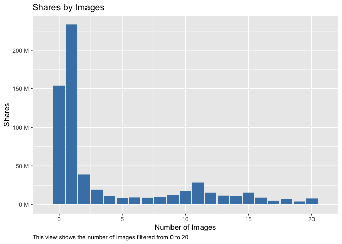

Project Two
================
Mary Brown and Jennifer Relihan
10/21/2021

## Data

### Read in the data and learn about the dimensions as well as different column names.

``` r
library(magrittr)
library(dplyr)
Data<-read.csv("OnlineNewsPopularity.csv")  
dim(Data)  
```

    ## [1] 39644    61

``` r
names(Data)  
```

    ##  [1] "url"                           "timedelta"                     "n_tokens_title"               
    ##  [4] "n_tokens_content"              "n_unique_tokens"               "n_non_stop_words"             
    ##  [7] "n_non_stop_unique_tokens"      "num_hrefs"                     "num_self_hrefs"               
    ## [10] "num_imgs"                      "num_videos"                    "average_token_length"         
    ## [13] "num_keywords"                  "data_channel_is_lifestyle"     "data_channel_is_entertainment"
    ## [16] "data_channel_is_bus"           "data_channel_is_socmed"        "data_channel_is_tech"         
    ## [19] "data_channel_is_world"         "kw_min_min"                    "kw_max_min"                   
    ## [22] "kw_avg_min"                    "kw_min_max"                    "kw_max_max"                   
    ## [25] "kw_avg_max"                    "kw_min_avg"                    "kw_max_avg"                   
    ## [28] "kw_avg_avg"                    "self_reference_min_shares"     "self_reference_max_shares"    
    ## [31] "self_reference_avg_sharess"    "weekday_is_monday"             "weekday_is_tuesday"           
    ## [34] "weekday_is_wednesday"          "weekday_is_thursday"           "weekday_is_friday"            
    ## [37] "weekday_is_saturday"           "weekday_is_sunday"             "is_weekend"                   
    ## [40] "LDA_00"                        "LDA_01"                        "LDA_02"                       
    ## [43] "LDA_03"                        "LDA_04"                        "global_subjectivity"          
    ## [46] "global_sentiment_polarity"     "global_rate_positive_words"    "global_rate_negative_words"   
    ## [49] "rate_positive_words"           "rate_negative_words"           "avg_positive_polarity"        
    ## [52] "min_positive_polarity"         "max_positive_polarity"         "avg_negative_polarity"        
    ## [55] "min_negative_polarity"         "max_negative_polarity"         "title_subjectivity"           
    ## [58] "title_sentiment_polarity"      "abs_title_subjectivity"        "abs_title_sentiment_polarity" 
    ## [61] "shares"

``` r
str(Data)
```

    ## 'data.frame':    39644 obs. of  61 variables:
    ##  $ url                          : chr  "http://mashable.com/2013/01/07/amazon-instant-video-browser/" "http://mashable.com/2013/01/07/ap-samsung-sponsored-tweets/" "http://mashable.com/2013/01/07/apple-40-billion-app-downloads/" "http://mashable.com/2013/01/07/astronaut-notre-dame-bcs/" ...
    ##  $ timedelta                    : num  731 731 731 731 731 731 731 731 731 731 ...
    ##  $ n_tokens_title               : num  12 9 9 9 13 10 8 12 11 10 ...
    ##  $ n_tokens_content             : num  219 255 211 531 1072 ...
    ##  $ n_unique_tokens              : num  0.664 0.605 0.575 0.504 0.416 ...
    ##  $ n_non_stop_words             : num  1 1 1 1 1 ...
    ##  $ n_non_stop_unique_tokens     : num  0.815 0.792 0.664 0.666 0.541 ...
    ##  $ num_hrefs                    : num  4 3 3 9 19 2 21 20 2 4 ...
    ##  $ num_self_hrefs               : num  2 1 1 0 19 2 20 20 0 1 ...
    ##  $ num_imgs                     : num  1 1 1 1 20 0 20 20 0 1 ...
    ##  $ num_videos                   : num  0 0 0 0 0 0 0 0 0 1 ...
    ##  $ average_token_length         : num  4.68 4.91 4.39 4.4 4.68 ...
    ##  $ num_keywords                 : num  5 4 6 7 7 9 10 9 7 5 ...
    ##  $ data_channel_is_lifestyle    : num  0 0 0 0 0 0 1 0 0 0 ...
    ##  $ data_channel_is_entertainment: num  1 0 0 1 0 0 0 0 0 0 ...
    ##  $ data_channel_is_bus          : num  0 1 1 0 0 0 0 0 0 0 ...
    ##  $ data_channel_is_socmed       : num  0 0 0 0 0 0 0 0 0 0 ...
    ##  $ data_channel_is_tech         : num  0 0 0 0 1 1 0 1 1 0 ...
    ##  $ data_channel_is_world        : num  0 0 0 0 0 0 0 0 0 1 ...
    ##  $ kw_min_min                   : num  0 0 0 0 0 0 0 0 0 0 ...
    ##  $ kw_max_min                   : num  0 0 0 0 0 0 0 0 0 0 ...
    ##  $ kw_avg_min                   : num  0 0 0 0 0 0 0 0 0 0 ...
    ##  $ kw_min_max                   : num  0 0 0 0 0 0 0 0 0 0 ...
    ##  $ kw_max_max                   : num  0 0 0 0 0 0 0 0 0 0 ...
    ##  $ kw_avg_max                   : num  0 0 0 0 0 0 0 0 0 0 ...
    ##  $ kw_min_avg                   : num  0 0 0 0 0 0 0 0 0 0 ...
    ##  $ kw_max_avg                   : num  0 0 0 0 0 0 0 0 0 0 ...
    ##  $ kw_avg_avg                   : num  0 0 0 0 0 0 0 0 0 0 ...
    ##  $ self_reference_min_shares    : num  496 0 918 0 545 8500 545 545 0 0 ...
    ##  $ self_reference_max_shares    : num  496 0 918 0 16000 8500 16000 16000 0 0 ...
    ##  $ self_reference_avg_sharess   : num  496 0 918 0 3151 ...
    ##  $ weekday_is_monday            : num  1 1 1 1 1 1 1 1 1 1 ...
    ##  $ weekday_is_tuesday           : num  0 0 0 0 0 0 0 0 0 0 ...
    ##  $ weekday_is_wednesday         : num  0 0 0 0 0 0 0 0 0 0 ...
    ##  $ weekday_is_thursday          : num  0 0 0 0 0 0 0 0 0 0 ...
    ##  $ weekday_is_friday            : num  0 0 0 0 0 0 0 0 0 0 ...
    ##  $ weekday_is_saturday          : num  0 0 0 0 0 0 0 0 0 0 ...
    ##  $ weekday_is_sunday            : num  0 0 0 0 0 0 0 0 0 0 ...
    ##  $ is_weekend                   : num  0 0 0 0 0 0 0 0 0 0 ...
    ##  $ LDA_00                       : num  0.5003 0.7998 0.2178 0.0286 0.0286 ...
    ##  $ LDA_01                       : num  0.3783 0.05 0.0333 0.4193 0.0288 ...
    ##  $ LDA_02                       : num  0.04 0.0501 0.0334 0.4947 0.0286 ...
    ##  $ LDA_03                       : num  0.0413 0.0501 0.0333 0.0289 0.0286 ...
    ##  $ LDA_04                       : num  0.0401 0.05 0.6822 0.0286 0.8854 ...
    ##  $ global_subjectivity          : num  0.522 0.341 0.702 0.43 0.514 ...
    ##  $ global_sentiment_polarity    : num  0.0926 0.1489 0.3233 0.1007 0.281 ...
    ##  $ global_rate_positive_words   : num  0.0457 0.0431 0.0569 0.0414 0.0746 ...
    ##  $ global_rate_negative_words   : num  0.0137 0.01569 0.00948 0.02072 0.01213 ...
    ##  $ rate_positive_words          : num  0.769 0.733 0.857 0.667 0.86 ...
    ##  $ rate_negative_words          : num  0.231 0.267 0.143 0.333 0.14 ...
    ##  $ avg_positive_polarity        : num  0.379 0.287 0.496 0.386 0.411 ...
    ##  $ min_positive_polarity        : num  0.1 0.0333 0.1 0.1364 0.0333 ...
    ##  $ max_positive_polarity        : num  0.7 0.7 1 0.8 1 0.6 1 1 0.8 0.5 ...
    ##  $ avg_negative_polarity        : num  -0.35 -0.119 -0.467 -0.37 -0.22 ...
    ##  $ min_negative_polarity        : num  -0.6 -0.125 -0.8 -0.6 -0.5 -0.4 -0.5 -0.5 -0.125 -0.5 ...
    ##  $ max_negative_polarity        : num  -0.2 -0.1 -0.133 -0.167 -0.05 ...
    ##  $ title_subjectivity           : num  0.5 0 0 0 0.455 ...
    ##  $ title_sentiment_polarity     : num  -0.188 0 0 0 0.136 ...
    ##  $ abs_title_subjectivity       : num  0 0.5 0.5 0.5 0.0455 ...
    ##  $ abs_title_sentiment_polarity : num  0.188 0 0 0 0.136 ...
    ##  $ shares                       : int  593 711 1500 1200 505 855 556 891 3600 710 ...

### After reviewing the attributes information on the website, we need to remove the non=predictive variables which are URL and Time Delta.

``` r
Data <- Data %>% select(-url, -timedelta)
```

## Subset

### Subset the data by channels and create a vector of all of the channels we are interested in.

``` r
EntertainmentChannel <- Data %>% filter(data_channel_is_entertainment == TRUE) %>% select(-starts_with("data_channel_is_"))  

AllChannels <- Data %>% select(starts_with("data_channel_is_")) %>% names  
```

### Check for any missing values.

``` r
sum(is.na(Data))  
```

    ## [1] 0

## Summary Statistics

### Here we produced some summary statistics and graphs of the data. First, we looked at a full summary on each column of our data. Next, we decided to specifically look further into total shares by days of the week. In order to do summaries on days of the week, we needed to gather the days/values by shares and filter by true values. The first summary shows the standard deviation, average, median, and IQR for each day of the week by shares. The second summary shows the same summary statistics for each day of the week by minimum amount of shares.

``` r
library(tidyverse)  
summary(Data) 
```

    ##  n_tokens_title n_tokens_content n_unique_tokens    n_non_stop_words    n_non_stop_unique_tokens   num_hrefs     
    ##  Min.   : 2.0   Min.   :   0.0   Min.   :  0.0000   Min.   :   0.0000   Min.   :  0.0000         Min.   :  0.00  
    ##  1st Qu.: 9.0   1st Qu.: 246.0   1st Qu.:  0.4709   1st Qu.:   1.0000   1st Qu.:  0.6257         1st Qu.:  4.00  
    ##  Median :10.0   Median : 409.0   Median :  0.5392   Median :   1.0000   Median :  0.6905         Median :  8.00  
    ##  Mean   :10.4   Mean   : 546.5   Mean   :  0.5482   Mean   :   0.9965   Mean   :  0.6892         Mean   : 10.88  
    ##  3rd Qu.:12.0   3rd Qu.: 716.0   3rd Qu.:  0.6087   3rd Qu.:   1.0000   3rd Qu.:  0.7546         3rd Qu.: 14.00  
    ##  Max.   :23.0   Max.   :8474.0   Max.   :701.0000   Max.   :1042.0000   Max.   :650.0000         Max.   :304.00  
    ##  num_self_hrefs       num_imgs         num_videos    average_token_length  num_keywords    data_channel_is_lifestyle
    ##  Min.   :  0.000   Min.   :  0.000   Min.   : 0.00   Min.   :0.000        Min.   : 1.000   Min.   :0.00000          
    ##  1st Qu.:  1.000   1st Qu.:  1.000   1st Qu.: 0.00   1st Qu.:4.478        1st Qu.: 6.000   1st Qu.:0.00000          
    ##  Median :  3.000   Median :  1.000   Median : 0.00   Median :4.664        Median : 7.000   Median :0.00000          
    ##  Mean   :  3.294   Mean   :  4.544   Mean   : 1.25   Mean   :4.548        Mean   : 7.224   Mean   :0.05295          
    ##  3rd Qu.:  4.000   3rd Qu.:  4.000   3rd Qu.: 1.00   3rd Qu.:4.855        3rd Qu.: 9.000   3rd Qu.:0.00000          
    ##  Max.   :116.000   Max.   :128.000   Max.   :91.00   Max.   :8.042        Max.   :10.000   Max.   :1.00000          
    ##  data_channel_is_entertainment data_channel_is_bus data_channel_is_socmed data_channel_is_tech data_channel_is_world
    ##  Min.   :0.000                 Min.   :0.0000      Min.   :0.0000         Min.   :0.0000       Min.   :0.0000       
    ##  1st Qu.:0.000                 1st Qu.:0.0000      1st Qu.:0.0000         1st Qu.:0.0000       1st Qu.:0.0000       
    ##  Median :0.000                 Median :0.0000      Median :0.0000         Median :0.0000       Median :0.0000       
    ##  Mean   :0.178                 Mean   :0.1579      Mean   :0.0586         Mean   :0.1853       Mean   :0.2126       
    ##  3rd Qu.:0.000                 3rd Qu.:0.0000      3rd Qu.:0.0000         3rd Qu.:0.0000       3rd Qu.:0.0000       
    ##  Max.   :1.000                 Max.   :1.0000      Max.   :1.0000         Max.   :1.0000       Max.   :1.0000       
    ##    kw_min_min       kw_max_min       kw_avg_min        kw_min_max       kw_max_max       kw_avg_max       kw_min_avg  
    ##  Min.   : -1.00   Min.   :     0   Min.   :   -1.0   Min.   :     0   Min.   :     0   Min.   :     0   Min.   :  -1  
    ##  1st Qu.: -1.00   1st Qu.:   445   1st Qu.:  141.8   1st Qu.:     0   1st Qu.:843300   1st Qu.:172847   1st Qu.:   0  
    ##  Median : -1.00   Median :   660   Median :  235.5   Median :  1400   Median :843300   Median :244572   Median :1024  
    ##  Mean   : 26.11   Mean   :  1154   Mean   :  312.4   Mean   : 13612   Mean   :752324   Mean   :259282   Mean   :1117  
    ##  3rd Qu.:  4.00   3rd Qu.:  1000   3rd Qu.:  357.0   3rd Qu.:  7900   3rd Qu.:843300   3rd Qu.:330980   3rd Qu.:2057  
    ##  Max.   :377.00   Max.   :298400   Max.   :42827.9   Max.   :843300   Max.   :843300   Max.   :843300   Max.   :3613  
    ##    kw_max_avg       kw_avg_avg    self_reference_min_shares self_reference_max_shares self_reference_avg_sharess
    ##  Min.   :     0   Min.   :    0   Min.   :     0            Min.   :     0            Min.   :     0.0          
    ##  1st Qu.:  3562   1st Qu.: 2382   1st Qu.:   639            1st Qu.:  1100            1st Qu.:   981.2          
    ##  Median :  4356   Median : 2870   Median :  1200            Median :  2800            Median :  2200.0          
    ##  Mean   :  5657   Mean   : 3136   Mean   :  3999            Mean   : 10329            Mean   :  6401.7          
    ##  3rd Qu.:  6020   3rd Qu.: 3600   3rd Qu.:  2600            3rd Qu.:  8000            3rd Qu.:  5200.0          
    ##  Max.   :298400   Max.   :43568   Max.   :843300            Max.   :843300            Max.   :843300.0          
    ##  weekday_is_monday weekday_is_tuesday weekday_is_wednesday weekday_is_thursday weekday_is_friday weekday_is_saturday
    ##  Min.   :0.000     Min.   :0.0000     Min.   :0.0000       Min.   :0.0000      Min.   :0.0000    Min.   :0.00000    
    ##  1st Qu.:0.000     1st Qu.:0.0000     1st Qu.:0.0000       1st Qu.:0.0000      1st Qu.:0.0000    1st Qu.:0.00000    
    ##  Median :0.000     Median :0.0000     Median :0.0000       Median :0.0000      Median :0.0000    Median :0.00000    
    ##  Mean   :0.168     Mean   :0.1864     Mean   :0.1875       Mean   :0.1833      Mean   :0.1438    Mean   :0.06188    
    ##  3rd Qu.:0.000     3rd Qu.:0.0000     3rd Qu.:0.0000       3rd Qu.:0.0000      3rd Qu.:0.0000    3rd Qu.:0.00000    
    ##  Max.   :1.000     Max.   :1.0000     Max.   :1.0000       Max.   :1.0000      Max.   :1.0000    Max.   :1.00000    
    ##  weekday_is_sunday   is_weekend         LDA_00            LDA_01            LDA_02            LDA_03       
    ##  Min.   :0.00000   Min.   :0.0000   Min.   :0.00000   Min.   :0.00000   Min.   :0.00000   Min.   :0.00000  
    ##  1st Qu.:0.00000   1st Qu.:0.0000   1st Qu.:0.02505   1st Qu.:0.02501   1st Qu.:0.02857   1st Qu.:0.02857  
    ##  Median :0.00000   Median :0.0000   Median :0.03339   Median :0.03334   Median :0.04000   Median :0.04000  
    ##  Mean   :0.06904   Mean   :0.1309   Mean   :0.18460   Mean   :0.14126   Mean   :0.21632   Mean   :0.22377  
    ##  3rd Qu.:0.00000   3rd Qu.:0.0000   3rd Qu.:0.24096   3rd Qu.:0.15083   3rd Qu.:0.33422   3rd Qu.:0.37576  
    ##  Max.   :1.00000   Max.   :1.0000   Max.   :0.92699   Max.   :0.92595   Max.   :0.92000   Max.   :0.92653  
    ##      LDA_04        global_subjectivity global_sentiment_polarity global_rate_positive_words global_rate_negative_words
    ##  Min.   :0.00000   Min.   :0.0000      Min.   :-0.39375          Min.   :0.00000            Min.   :0.000000          
    ##  1st Qu.:0.02857   1st Qu.:0.3962      1st Qu.: 0.05776          1st Qu.:0.02838            1st Qu.:0.009615          
    ##  Median :0.04073   Median :0.4535      Median : 0.11912          Median :0.03902            Median :0.015337          
    ##  Mean   :0.23403   Mean   :0.4434      Mean   : 0.11931          Mean   :0.03962            Mean   :0.016612          
    ##  3rd Qu.:0.39999   3rd Qu.:0.5083      3rd Qu.: 0.17783          3rd Qu.:0.05028            3rd Qu.:0.021739          
    ##  Max.   :0.92719   Max.   :1.0000      Max.   : 0.72784          Max.   :0.15549            Max.   :0.184932          
    ##  rate_positive_words rate_negative_words avg_positive_polarity min_positive_polarity max_positive_polarity
    ##  Min.   :0.0000      Min.   :0.0000      Min.   :0.0000        Min.   :0.00000       Min.   :0.0000       
    ##  1st Qu.:0.6000      1st Qu.:0.1852      1st Qu.:0.3062        1st Qu.:0.05000       1st Qu.:0.6000       
    ##  Median :0.7105      Median :0.2800      Median :0.3588        Median :0.10000       Median :0.8000       
    ##  Mean   :0.6822      Mean   :0.2879      Mean   :0.3538        Mean   :0.09545       Mean   :0.7567       
    ##  3rd Qu.:0.8000      3rd Qu.:0.3846      3rd Qu.:0.4114        3rd Qu.:0.10000       3rd Qu.:1.0000       
    ##  Max.   :1.0000      Max.   :1.0000      Max.   :1.0000        Max.   :1.00000       Max.   :1.0000       
    ##  avg_negative_polarity min_negative_polarity max_negative_polarity title_subjectivity title_sentiment_polarity
    ##  Min.   :-1.0000       Min.   :-1.0000       Min.   :-1.0000       Min.   :0.0000     Min.   :-1.00000        
    ##  1st Qu.:-0.3284       1st Qu.:-0.7000       1st Qu.:-0.1250       1st Qu.:0.0000     1st Qu.: 0.00000        
    ##  Median :-0.2533       Median :-0.5000       Median :-0.1000       Median :0.1500     Median : 0.00000        
    ##  Mean   :-0.2595       Mean   :-0.5219       Mean   :-0.1075       Mean   :0.2824     Mean   : 0.07143        
    ##  3rd Qu.:-0.1869       3rd Qu.:-0.3000       3rd Qu.:-0.0500       3rd Qu.:0.5000     3rd Qu.: 0.15000        
    ##  Max.   : 0.0000       Max.   : 0.0000       Max.   : 0.0000       Max.   :1.0000     Max.   : 1.00000        
    ##  abs_title_subjectivity abs_title_sentiment_polarity     shares      
    ##  Min.   :0.0000         Min.   :0.0000               Min.   :     1  
    ##  1st Qu.:0.1667         1st Qu.:0.0000               1st Qu.:   946  
    ##  Median :0.5000         Median :0.0000               Median :  1400  
    ##  Mean   :0.3418         Mean   :0.1561               Mean   :  3395  
    ##  3rd Qu.:0.5000         3rd Qu.:0.2500               3rd Qu.:  2800  
    ##  Max.   :0.5000         Max.   :1.0000               Max.   :843300

``` r
Days <- Data %>% pivot_longer(starts_with("weekday_is"), names_to = "day", values_to = "data") %>% filter(data == TRUE) 

Summary1 <- Days %>% group_by(day) %>% summarize(std = sd(shares), average = mean(shares), median = median(shares), IQR = IQR(shares))  
print(Summary1)
```

    ## # A tibble: 7 × 5
    ##   day                     std average median   IQR
    ##   <chr>                 <dbl>   <dbl>  <dbl> <dbl>
    ## 1 weekday_is_friday     8149.   3285.   1500 1726 
    ## 2 weekday_is_monday    14691.   3647.   1400 1781 
    ## 3 weekday_is_saturday  14231.   4078.   2000 2300 
    ## 4 weekday_is_sunday     6215.   3747.   1900 2500 
    ## 5 weekday_is_thursday   9436.   3179.   1400 1698 
    ## 6 weekday_is_tuesday    9798.   3203.   1300 1603 
    ## 7 weekday_is_wednesday 14588.   3303.   1300 1712.

``` r
Summary2 <- Days %>% group_by(day) %>% summarize(std = sd(kw_min_min), average = mean(kw_min_min), median = median(kw_min_min), IQR = IQR(kw_min_min))  
print(Summary2)  
```

    ## # A tibble: 7 × 5
    ##   day                    std average median   IQR
    ##   <chr>                <dbl>   <dbl>  <dbl> <dbl>
    ## 1 weekday_is_friday     70.1    26.5     -1     5
    ## 2 weekday_is_monday     70.0    26.3     -1     5
    ## 3 weekday_is_saturday   65.3    22.8     -1     5
    ## 4 weekday_is_sunday     71.8    27.9     -1     5
    ## 5 weekday_is_thursday   70.5    26.9     -1     5
    ## 6 weekday_is_tuesday    67.9    24.7     -1     5
    ## 7 weekday_is_wednesday  70.4    26.8     -1     5

## Section for Plots

``` r
library(ggplot2)  
library(scales)  

Videos <- ggplot(Data, aes(x = num_videos, y = shares)) + geom_bar(stat = "identity", fill = "tan3") + xlim(-1,21) + scale_y_continuous(labels = unit_format(unit = "M", scale = 5e-6)) + ggtitle("Shares by Videos") + labs(y = "Shares", x = "Number of Videos", caption = "This view shows the number of videos filtered from 0 to 20.") + theme(plot.caption = element_text(hjust = 0))  
print(Videos)
```

<!-- -->

``` r
Images <- ggplot(Data, aes(x = num_imgs, y = shares)) + geom_bar(stat = "identity", fill = "steelblue") + xlim(-1,21) + scale_y_continuous(labels = unit_format(unit = "M", scale = 5e-6)) + ggtitle("Shares by Images") + labs(y = "Shares", x = "Number of Images", caption = "This view shows the number of images filtered from 0 to 20.") + theme(plot.caption = element_text(hjust =0))
print(Images) 
```

<!-- -->

## Modeling

### In this section we split the data - 70% train and 30% test

``` r
library(caret)  
NumericData <- dplyr::select_if(Data, is.numeric)
set.seed(123)
DataIndex<-createDataPartition(y = Data$shares, p = 0.7, list = FALSE)  
TrainData <- Data[DataIndex,]
TestData <- Data[-DataIndex,]
```

### Figure out which predictors to use

    ## 
    ## Call:
    ## lm(formula = shares ~ ., data = TrainData)
    ## 
    ## Residuals:
    ##    Min     1Q Median     3Q    Max 
    ## -32575  -2247  -1214    -95 837461 
    ## 
    ## Coefficients: (3 not defined because of singularities)
    ##                                 Estimate Std. Error t value Pr(>|t|)    
    ## (Intercept)                   -4.964e+02  1.107e+03  -0.449 0.653757    
    ## n_tokens_title                 8.746e+01  3.556e+01   2.459 0.013923 *  
    ## n_tokens_content               9.221e-01  2.812e-01   3.280 0.001041 ** 
    ## n_unique_tokens                4.544e+03  2.385e+03   1.905 0.056726 .  
    ## n_non_stop_words              -1.814e+03  6.212e+03  -0.292 0.770248    
    ## n_non_stop_unique_tokens      -2.213e+03  2.021e+03  -1.095 0.273380    
    ## num_hrefs                      2.350e+01  8.410e+00   2.794 0.005209 ** 
    ## num_self_hrefs                -7.756e+01  2.257e+01  -3.437 0.000589 ***
    ## num_imgs                       9.012e+00  1.104e+01   0.816 0.414303    
    ## num_videos                    -5.257e+00  1.917e+01  -0.274 0.783955    
    ## average_token_length          -5.059e+02  3.010e+02  -1.681 0.092834 .  
    ## num_keywords                   9.480e+01  4.620e+01   2.052 0.040188 *  
    ## data_channel_is_lifestyle     -1.129e+03  4.888e+02  -2.309 0.020968 *  
    ## data_channel_is_entertainment -1.368e+03  3.187e+02  -4.292 1.77e-05 ***
    ## data_channel_is_bus           -1.117e+03  4.745e+02  -2.353 0.018617 *  
    ## data_channel_is_socmed        -6.424e+02  4.621e+02  -1.390 0.164453    
    ## data_channel_is_tech          -6.947e+02  4.608e+02  -1.508 0.131681    
    ## data_channel_is_world         -8.361e+02  4.660e+02  -1.794 0.072786 .  
    ## kw_min_min                     2.679e+00  2.006e+00   1.335 0.181804    
    ## kw_max_min                     4.483e-02  6.153e-02   0.729 0.466203    
    ## kw_avg_min                    -4.391e-01  3.865e-01  -1.136 0.255910    
    ## kw_min_max                    -2.924e-03  1.430e-03  -2.045 0.040912 *  
    ## kw_max_max                    -5.778e-04  7.159e-04  -0.807 0.419566    
    ## kw_avg_max                     4.949e-04  1.033e-03   0.479 0.631740    
    ## kw_min_avg                    -3.035e-01  9.359e-02  -3.243 0.001186 ** 
    ## kw_max_avg                    -1.683e-01  3.089e-02  -5.448 5.13e-08 ***
    ## kw_avg_avg                     1.430e+00  1.750e-01   8.172 3.15e-16 ***
    ## self_reference_min_shares      4.049e-02  9.482e-03   4.271 1.96e-05 ***
    ## self_reference_max_shares      6.038e-03  5.029e-03   1.201 0.229904    
    ## self_reference_avg_sharess    -8.398e-03  1.290e-02  -0.651 0.515087    
    ## weekday_is_monday              1.678e+02  3.282e+02   0.511 0.609088    
    ## weekday_is_tuesday            -2.417e+02  3.233e+02  -0.748 0.454726    
    ## weekday_is_wednesday          -9.747e+01  3.231e+02  -0.302 0.762921    
    ## weekday_is_thursday           -3.832e+02  3.242e+02  -1.182 0.237183    
    ## weekday_is_friday             -1.531e+02  3.350e+02  -0.457 0.647665    
    ## weekday_is_saturday            3.400e+02  3.995e+02   0.851 0.394829    
    ## weekday_is_sunday                     NA         NA      NA       NA    
    ## is_weekend                            NA         NA      NA       NA    
    ## LDA_00                         5.860e+02  5.663e+02   1.035 0.300848    
    ## LDA_01                        -7.567e+01  6.288e+02  -0.120 0.904221    
    ## LDA_02                        -6.799e+02  5.660e+02  -1.201 0.229661    
    ## LDA_03                         1.903e+02  5.960e+02   0.319 0.749469    
    ## LDA_04                                NA         NA      NA       NA    
    ## global_subjectivity            2.569e+03  1.058e+03   2.429 0.015159 *  
    ## global_sentiment_polarity      1.537e+03  2.058e+03   0.747 0.455208    
    ## global_rate_positive_words    -1.679e+04  8.828e+03  -1.902 0.057150 .  
    ## global_rate_negative_words     2.708e+03  1.670e+04   0.162 0.871164    
    ## rate_positive_words            2.262e+03  6.012e+03   0.376 0.706714    
    ## rate_negative_words            2.630e+03  6.078e+03   0.433 0.665294    
    ## avg_positive_polarity         -1.808e+03  1.693e+03  -1.068 0.285724    
    ## min_positive_polarity         -2.717e+03  1.426e+03  -1.906 0.056716 .  
    ## max_positive_polarity          2.460e+02  5.354e+02   0.460 0.645856    
    ## avg_negative_polarity         -2.248e+03  1.566e+03  -1.436 0.151147    
    ## min_negative_polarity          6.304e+02  5.689e+02   1.108 0.267812    
    ## max_negative_polarity         -7.750e+02  1.300e+03  -0.596 0.551071    
    ## title_subjectivity            -1.924e+02  3.414e+02  -0.564 0.573086    
    ## title_sentiment_polarity       2.826e+02  3.111e+02   0.908 0.363745    
    ## abs_title_subjectivity         5.184e+02  4.530e+02   1.144 0.252478    
    ## abs_title_sentiment_polarity   4.781e+02  4.929e+02   0.970 0.332076    
    ## ---
    ## Signif. codes:  0 '***' 0.001 '**' 0.01 '*' 0.05 '.' 0.1 ' ' 1
    ## 
    ## Residual standard error: 11950 on 27696 degrees of freedom
    ## Multiple R-squared:  0.02271,    Adjusted R-squared:  0.02077 
    ## F-statistic:  11.7 on 55 and 27696 DF,  p-value: < 2.2e-16

    ## 
    ## Call:
    ## lm(formula = shares ~ num_self_hrefs + data_channel_is_entertainment + 
    ##     kw_max_avg + kw_avg_avg + self_reference_min_shares, data = TrainData)
    ## 
    ## Residuals:
    ##    Min     1Q Median     3Q    Max 
    ## -31214  -2261  -1442   -305 838893 
    ## 
    ## Coefficients:
    ##                                 Estimate Std. Error t value Pr(>|t|)    
    ## (Intercept)                   -2.920e+02  2.329e+02  -1.254   0.2099    
    ## num_self_hrefs                -9.121e+00  1.901e+01  -0.480   0.6314    
    ## data_channel_is_entertainment -4.831e+02  1.883e+02  -2.565   0.0103 *  
    ## kw_max_avg                    -1.599e-01  1.980e-02  -8.075 7.04e-16 ***
    ## kw_avg_avg                     1.455e+00  9.253e-02  15.731  < 2e-16 ***
    ## self_reference_min_shares      3.913e-02  4.007e-03   9.765  < 2e-16 ***
    ## ---
    ## Signif. codes:  0 '***' 0.001 '**' 0.01 '*' 0.05 '.' 0.1 ' ' 1
    ## 
    ## Residual standard error: 11980 on 27746 degrees of freedom
    ## Multiple R-squared:  0.01585,    Adjusted R-squared:  0.01567 
    ## F-statistic: 89.37 on 5 and 27746 DF,  p-value: < 2.2e-16
